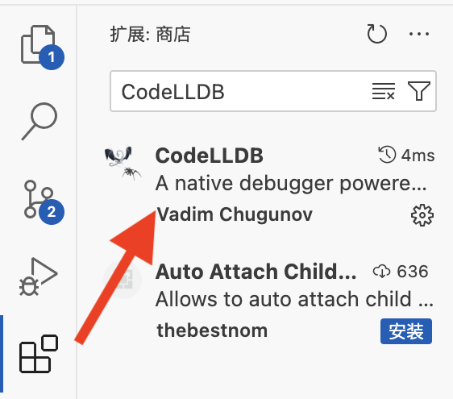
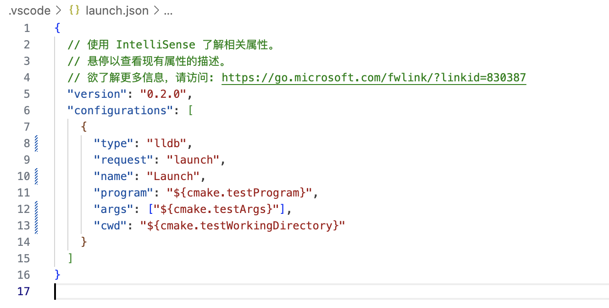
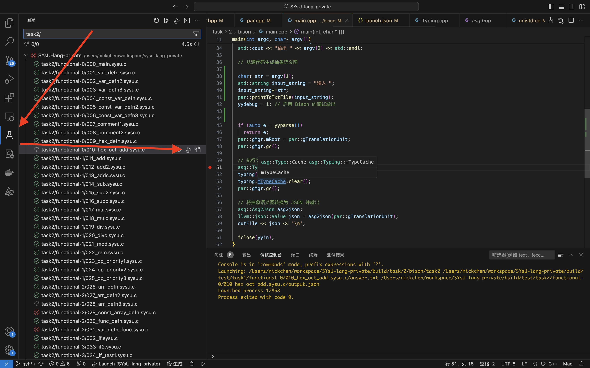
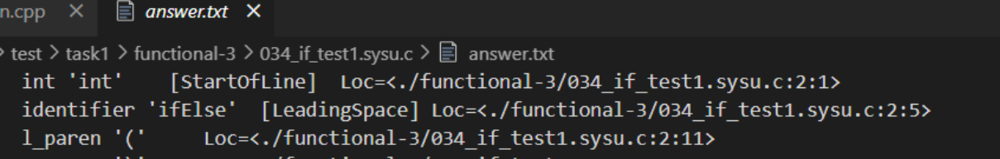
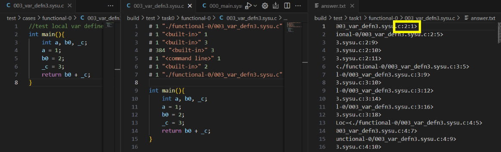

# 常见问题与答案

我们编译原理助教众多，希望同学们踊跃提问。同时我们会挑选一些比较有代表性或者提问次数较多的问题放到这里供同学们查阅。

## 环境配置

#### 1.WSL环境下使用 `systemctl`指令报错：`System has not been booted with systemd as init system (PID 1). Can’t operate.`

由于部分WSL使用 `SysV init`而非 `systemd`管理服务，解决方法是使用 `service`指令代替 `systemctl`指令。

#### 2.如何更新代码仓库: 请在终端依次输入以下指令

（注意：你的终端所在目录应在实验代码文件夹根目录下，如果你不确定，请新建终端）

```bash
git stash	# 将当前未提交的修改暂时储藏
git pull	# 从远程仓库拉取新的实验代码
git stash pop	# 恢复先前暂时储藏的修改
```

#### 3.MacOS + VSCode 如何进入单步调试

1. 安装VSCode插件 `CodeLLDB`  

2. 在`.vscode/launch.json`中加入以下配置
```
{
    "type": "lldb",
    "request": "launch",
    "name": "Launch",
    "program": "${cmake.testProgram}",
    "args": ["${cmake.testArgs}"],
    "cwd": "${cmake.testWorkingDirectory}"
}
```

3. 打上断点，在`测试`插件中对单个测例进行单步调试


## 实验一
#### 1.在task1中存在部分Loc要求输出相对路径，部分Loc要求输出绝对路径，是否需要针对不同要求编写不同方式的print_token?


答：相对路径与绝对路径的区别并不是print_token()函数导致的，而是由于clang预处理时输出格式不同所导致的（详见task0-answer生成的预处理源代码，路径为build/test/task0/*），词法规则中对预处理信息的处理可以提供文件路径信息，可以关注预处理信息中的最后一条。

#### 2.预处理文件中没有关于源文件的行号信息，如何识别出词法单元出现在源文件中的位置？是否需要额外编写脚本？
答：关于源文件的行号信息，需要从预处理文件中的预处理信息中获取，无需额外编写脚本  
例如# 1 "./basic/000_main.sysu.c" 2：其中'#'右边的数字1即下一行有效内容出现在对应源文件中的行数（可自行比对预处理后的源文件与标准输出answer.txt），此后的行号/列号信息需要自行维护  
如图是003样例的源文件，预处理文件和答案，起始行并不是1


#### 3.词法单元出现在源文件中的位置和源文件的路径需要输出吗？
答：除EOF和不可见字符外，需要输出其他所有词法单元在源文件的位置和源文件的路径

#### 4.如何理解预处理信息?
问题描述：为什么预处理信息中有多个地址,我选取哪一个?是最后一个吗?  
为什么下图中answer中第一个void是第十行?是因为第九行的#号后面的10吗?为什么不采用第一行或者第八行#后的1呢?  
地址后面跟着的数字是什么意思?是为了干扰预处理吗?需要提取出来用在哪里吗?  
答：
1. 预处理信息应选取最后一个地址
2. 因为在"sylib.h"头文件中，"void _sysy_starttime..."为第10行；预处理信息第九行的意思是下一行的词法单元处于源文件中的行号
3. 地址后的数字与输出无关，可忽略

## 实验二
*持续更新中*