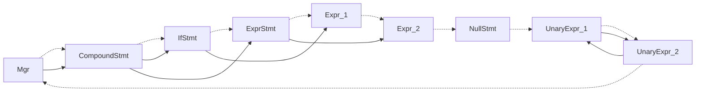

# 抽象语义图（ASG）

现在我们讨论抽象语义图的设计。今时不同往日，这次我不再像之前《实验攻略》里那样举什么简化的小例子来说明了，因为整个实验所需的完整抽象语义图代码已经由我们实现，并且直接作为框架的基础代码提供了：即 [`/task/2/common/asg.hpp` 这个文件](/task/2/common/asg.hpp)。这个文件贯穿任务二和任务三，称之为实验代码的核心并不为过。

> 在制作这个实验框架之前，由于任务二要求输入词法单元流、输出的 Clang JSON 语法树，很多学生容易犯的一个设计错误就是像写其它算法作业一样，尝试一步到位直接将词法单元流转换成语法树的。他们先实现一个简单的版本，能够通过前几个测例，然后逐渐地加入新情况的处理代码。可是学生一般很快就会发现这些代码的数量远超预期，在绝大多数情况下，他们都会卡在某个解决不掉的 BUG 上，最终在实验的截止日期到来时放弃努力。不过，也有少数同学有足够的耐心和毅力解决所有的问题，最终完成实验。而现在，有了这个实验框架，我们可以确保大家不会走入这个误区，然而，知道框架为什么要这样设计仍然是很有必要的。

ASG 的设计要点包括：

1. 让所有的结构体继承一个多态基类 `Obj`，并使用垃圾收集管理所有的实例。

   `Obj` 的析构函数要声明为虚方法，这是为了使能子类的运行时类型识别（RTTI）。

   框架的基础代码已经实现了具有垃圾收集功能的对象系统，学生只需要学会其使用，不需要关心其实现。对于那些感兴趣的人，我会在下文详细介绍其设计实现。

2. 使用简单直白的结构体和 C 原始指针。

   不需要用什么类封装、`std::unique_ptr`、`std::shared_ptr` 等等。

3. 使用继承刻画一般到特殊的关系，并将公共成员提取到基类中。

   例如，对于 `表达式 -> 立即数 | 一元表达式 | 二元表达式` 这样的产生式。在 `asg.hpp` 中，它们分别对应 `Expr`、`IntegerLiteral`、`UnaryExpr`、`BinaryExpr` 这四个结构体。后三者都继承自 `Expr`，而 `Expr` 中有两个公共成员 `type` 和 `cate`，分别表示表达式的类型和类别。之所以有这两个成员，完全对应 [C 语言标准中的表述](https://zh.cppreference.com/w/c/language/value_category)：

   > C 中每个表达式（带有实参的运算符、函数调用、常量、变量名等）以两个独立属性刻画：类型和值类别。

4. 给结构体所有的成员都赋予一个默认值，指针初始化为 `nullptr`。

   尽管这可能挺起来像废话，但它可以避免错误逃逸，从而让你在调试时更容易地发现问题。

5. 使用 Visitor 模式遍历 ASG，而不是在结构体中添加虚方法。

   （在下文中详细阐述）

6. 一些结点间的引用信息是可选的，但添加它们能够极大地方便一些程序分析与处理操作。

   例如，`asg.hpp` 中的 `ContinueStmt` 结构体，其 `loop` 成员指向它要跳出的循环结点。从语义上来说，这个成员是不必要的，因为 C 规定 `continue` 只能跳转到最近的循环开头。但是，如果没有这个成员，那么每次遇到 `continue` 语句时，你都需要想其它办法找到最近的循环开头——这不是一件容易的事情，因为从 `While` 结点到这个 `Continue` 结点之间可能有很多层，这就意味着你必须总要从顶层的结点开始遍历，直到找到这个 `Continue` 结点，这样的操作是非常低效的，代码也容易变得非常冗长。

## 垃圾收集（GC, Garbage Collection）

ASG 中所有的结构体使用起来都非常简单：在堆上分配一个实例，然后设置它的成员，就这样。然而，堆上的分配的实例是需要释放的，否则会造成内存泄漏。从完成实验的角度，内存泄漏并不是一个严重的问题，因为它至少不会影响程序的正确性，而每个测例在评测时都会重新启动一个进程。但这并不意味着这个问题可以放任不管，因为在一些极端的测例下（例如超级长的代码），它确实有可能耗尽内存，导致评测失败。

为了解决这个问题，在之前的[《实验攻略》](https://yhgu2000.github.io/posts/%E4%B8%AD%E5%B1%B1%E5%A4%A7%E5%AD%A6SYsUlang%E5%AE%9E%E9%AA%8C%E6%94%BB%E7%95%A5/#%E4%BD%BF%E7%94%A8%E6%89%80%E6%9C%89%E6%9D%83%E7%AE%A1%E7%90%86%E5%99%A8)中，我给出了一个简单的方案——所有权管理器，即：

```cpp
using Mgr = std::vector<std::unique_ptr<Obj*>>
```

然而这种方案实际上与内存泄漏也没有太大区别：如果在编译过程中生成了大量临时的中间对象，那么这些对象会和那些有用的对象一起被保存在 `Mgr` 中，在其它对象都失去使用价值前不会被释放掉。攻略里之所以这样写，是因为在这个框架之前，这一块工作需要学生自己来完成，而这个方案是最简单的。

要想彻底解决这个问题，必须要用一个有垃圾收集机制的对象系统，它识别出那些没有被使用的语义节点对象，并释放它们。设计一个好用的、不会出错的对象系统并不容易，而有了这个实验框架后，我们可以直接将实现良好的代码提供给学生：[`/task/2/common/obj.hpp`](/task/2/common/obj.hpp)与[`/task/2/common/obj.cpp`](/task/2/common/obj.cpp)。

该对象系统实现了一个“标记-清扫”的垃圾回收机制，该机制的实现主要在于两个类 `Obj` 与 `Obj::Mgr`。`Obj` 是所有结构体的基类，它有三个关键的成员：

- `Obj* __next__;`

  指向下一个对象。程序运行时的所有对象实例（继承自 `Obj` 的那些 ASG 节点结构体）通过这根指针在内存中形成一个超大的环形链表，我们把它称为“世界环”。

- `virtual Obj::~Obj();`

  析构函数，必须声明为虚方法，这是 C++ 基础知识。

- `virtual void Obj::__mark__(Mark mark) = 0;`

  标记函数，用于垃圾收集的可达性判定，参数 `mark` 是一个函数指针。所有子类必须实现这个方法，并在其中对对象（结构体）中包含的所有指向其它对象的指针调用 `mark`。

`__next__` 和 `__mark__` 一起，构成了 GC 机制的一半。另一半由 `Obj::Mgr` 完成，正如它的名字，`Mgr` 就是一个对象管理器，它有三个关键的成员：

- `Obj* mRoot;`

  指向垃圾收集的根对象。

- `void gc();`

  执行垃圾收集。

- `T* make(Args... args)`（模板函数）

  创建一个 T 类型的对象实例并托管，返回指向它的指针。

在使用这个对象系统时，第一件是是创建 `Mgr` 管理器对象，它会形成一个自环，然后当调用 `make` 函数时，新对象会被加到它的后面，当调用 `gc` 函数时，它从 `mRoot` 出发，遍历整个引用图，然后将世界环中没有标记到的对象释放掉。

举一个具体的例子来介绍“标记-清扫”算法的工作流程：



图中虚线表示 `__next__` 指针，可见所有对象首尾相连，形成一个环；实线表示对象的引用关系。标记阶段从 `Mgr` 指向的 `CompoundStmt` 根对象出发，遍历整个实线引用图，这时 `IfStmt`、`ExprStmt`、`Expr_1`、`Expr_2` 都会被打上标记。在清扫阶段，沿虚线遍历整个世界环，这时就会发现 `NullStmt`、`UnaryExpr_1`、`UnaryExpr_2` 没有被标记，于是它们会被释放掉。注意虽然 `UnaryExpr_1` 和 `UnaryExpr_2` 互相引用，但它们都会被释放，因为它们从根对象 `CompoundStmt` 不可达。

从算法角度来看，“标记-清扫”垃圾回收一点都不复杂，就是一个简单的图搜索问题。但是，如何设计接入这个算法的编程界面，使它能成为支撑所有其它代码的关键基础设施，才是这个问题真正有挑战的地方。如果没有对项目所用编程语言的丰富使用经验和深入的理解，是很难做到这一点的。

这种基于世界环的“标记-清扫”式垃圾回收虽然简单，但确实是工业级编程语言中的一种常见实现，[例如 Python 就通过对象前的 `PyGC_Head` 结构将所有对象串成一个双向链表](https://devguide.python.org/internals/garbage-collector/index.html#gc-for-the-default-build)。然而应当指出的是，这种方案在简单的同时，也是所有垃圾回收算法中比较低效的一种，虽然确实有更好的 GC 方案，但对于这个实验来说，本方案已经足够了。

> 垃圾回收的研究最早可一直追溯到 1959 年的 LISP 语言，它一直是编程语言领域一个最基础的研究课题，对系统的运行性能有关键的影响，相关资料浩如烟海，感兴趣的同学可以自行查阅。

没有在此处介绍的其它代码都是一些辅助工具，不是特别重要。

## Visitor 模式

所谓 Vistor 模式，是指这样一些类：

```cpp
class Visitor {
public:
  void operator()(A a);
  int operator()(B* b);
  char* operator()(C c);
};
```

它重载了一堆的 `operator()` 方法，每个方法适应于不同类型的处理，从而使得整个类可以处理多种不同的类型，它用于将代码的多态行为从要处理的对象中分离出来，以实现代码的内聚和解耦。

在本实验中，最典型的 Visitor 模式是 [`/task/2/common/Asg2Json.hpp` 中的 `Asg2Json` 类](/task/2/common/Asg2Json.hpp)，它的作用是将 ASG 转换成 JSON 格式以匹配 Clang 的输出。

Visitor 模式的对比设计方案是采用虚函数。为了理解使用 Visitor 模式的意义，让我们设想一下给 `asg.hpp` 中的结构都添加一个虚函数 `virtual json::Object to_json();`，然后把 `Asg2Json` 中的 `operator()` 方法分散到各个结构体中实现。这样做的问题在于：

- 代码分散，不易维护。如果有第二个 Visitor，这两个 Visitor 的方法声明都会混在一起，对编码造成干扰。
- 如果 Visitor 在遍历过程中需要保存一些额外的临时状态怎么办?（例如 `/task/2/antlr/Ast2Asg.hpp` 中的符号表 `Ast2Asg::mSymtbl`）难道要在每个结构体中都加上一个成员变量吗？
- 这个虚函数是不是应当也添加到 `Obj` 中？这样才能保证所有的 ASG 结构体都有这个方法？

因此，使用 Visitor 模式是一个更好的选择。那么，如果遇到多态的类怎么办呢？例如，在处理 `Expr*` 时，实际传入的可能是其子类对象的指针 `IntegerLiteral*`、`UnaryExpr*`、`BinaryExpr*` 等，这时我们就在 `Expr*` 的处理方法中使用 RTTI 来判断实际的类型，然后调用对应的方法，就像这样：

```cpp
void Visitor::operator()(Expr* obj) {
    if (auto p = dynamic_cast<IntegerLiteral*>(obj))
        return (*this)(p);
    if (auto p = dynamic_cast<UnaryExpr*>(obj))
        return (*this)(p);
    if (auto p = dynamic_cast<BinaryExpr*>(obj))
        return (*this)(p);
    /* ... */
}
```

没有必要在这里说得更详细了，如果你还想知道更多这种模式的实践，请直接参考[框架中的源代码 `/task/2/common/Asg2Json.cpp`](/task/2/common/Asg2Json.cpp)。

---

# 接下来：[《类型、类型检查与推导》](./类型、类型检查与推导.md)
