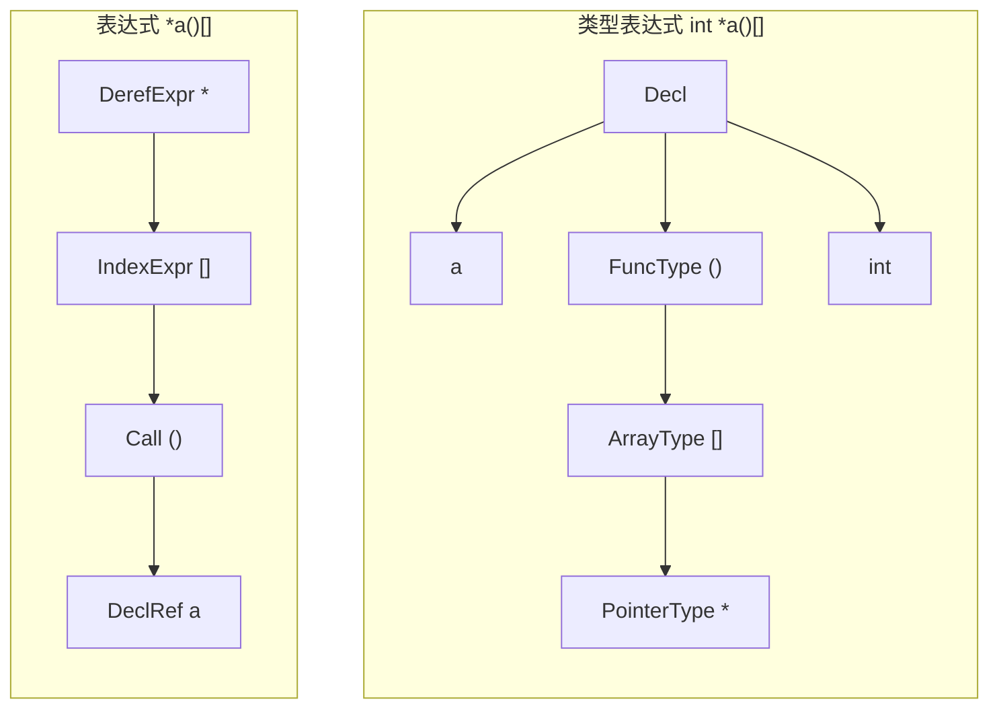
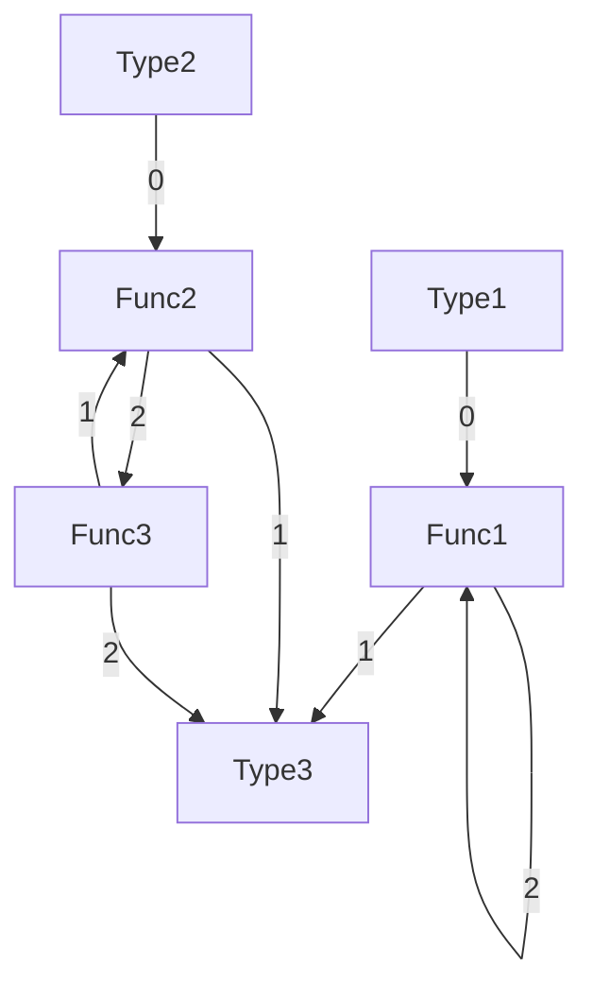
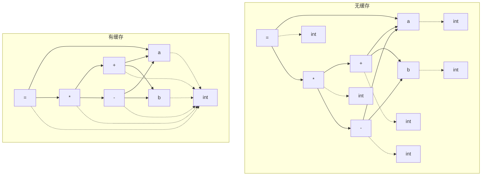

# 类型、类型检查与推导

[C 语言是这样解释“类型”的：](https://zh.cppreference.com/w/c/language/types)

> 对象、函数和表达式拥有称为类型的属性，它确定存储于对象或表达式求值所得的二进制值的判读方式。 

在本实验框架中，类型使用 `asg.hpp` 中的 `Type` 结构体来表示，它包含三个关键的数据成员：

- `Spec spec` 表示类型声明符；
- `Qual qual` 表示类型限定符；
- `TypeExpr* texp` 表示类型表达式。

声明符和限定符的区分直接对应 [C 语言标准中的表述](https://zh.cppreference.com/w/c/language/declarations)。类型表达式虽然在标准中没有直接体现，但是它确实是 C 语言的一个固有结构。

## 类型表达式

类型表达式 `TypeExpr` 及其子类用于表达 C 语言中的复杂类型，例如指针、数组、函数等。学生通常的误解是认为 C 语言的类型“就那么几个”，但实际上，即使不考虑 `struct` 和 `typedef` 这种自定义类型的存在，C 都有“无穷”个类型。这是因为指针（`*`）、数组（`[]`）、函数（`(...,...)）这些类型组合子的存在。

为了解释这里的复杂性，只需给出下面的一个声明：

```c
int*(*a())[](int*b[],int(*c[])(int**d,int(e)[]))(int*f);
```

你能告诉我这是一个变量还是一个函数的声明吗？（注：这个声明是合法的，你可以使用编译器来验证你的答案）

因此，类型不能使用简单的、有限的枚举来表示，而是需要使用一种复合的结构来表示，这种结构与语法树很类似，因此本实验框架中的 `Type` 和 `TypeExpr` 也都是继承自 `Obj` 的。

### C 的类型表达式和表达式

C 的一个特点，也是一直被人诟病的地方是，它的类型语法不是从左到右，也不是从右到左，而是“从内到外”。这非常地反直觉，我们无从知晓它的作者这么设计的真实用意，但可以明确地是，这种设计是在有意地向 C 的表达式语法看齐。

类型表达式的每个结点实际上是说明了它所声明的符号支持什么操作，例如：

```c
int *a()[];
```

以上是一个函数声明，我们需要像表达式一样去解析它，**`*`、`()`、`[]`都要遵循表达式的优先级**。因此，`a` 首先与 `()` 结合，然后是 `[]`，最后是 `*`。它的含义是，对于符号 `a`，应当先调用它（`()`），然后对结果应用方括号算符（`[]`），最后对结果应用指针算符（`*`），得到一个 `int`。

你可以看到，最先应当应用的操作符是最内层的操作符，这与表达式的求值顺序是一致的，**但它的语义结构却正好是其相应表达式的翻转**。对于写起来一模一样的表达式 `*a()[]`，它们的 ASG 分别是下面这样：



可以看到，两者的 `*`、`()`、`[]` 的顺序是正好是完全相反的。这意味这我们在实现类型表达式解析的时候，**必须要在最后翻转它**，因为语法解析过程是从外到内的。

## 类型的等价性

尽管类型看起来很复杂，但类型对象确切切实实地属于一种“值对象”，即类型对象之间存在一种等价关系，这种关系的成立并不限于简单的指针相等，而是要求对象的内容相等、对象指向对象的内容相等、对象指向对象指向的内容相等……等等，直到所有的内容都相等。显然，这是一个递归定义，这也是 `Type` 和 `TypeExpr` 的等价性判断方法 `bool operator==` 的实现方式。

然而，必须指出的是，这种定义方式并不能涵盖所有的类型等价情况。确切来讲，框架中的 `bool operator==` 无法处理类型表达式图中包含环的情况，例如：



当试图判断图中的 `Type1` 和 `Type2` 是否相等时，我们的算法就会陷入 `Func1` 上自环和 `Func2` 和 `Func3` 之间的环中，直到调用栈递归过深而溢出。

从语义上来说，上图的两种类型确实是等价的，因为从 `Type1` 和 `Type2` 出发的所有可能得到的路径是两个完全相同的集合。这种情况下的等价性判断并非不可能，但要复杂许多，但更关键的是，这种情况在实际的 C 语言中并不存在。带环的类型等价性判断通常出现在支持[共归纳类型（Coinductive Data Type）](https://en.wikipedia.org/wiki/Recursion_(computer_science)#Recursive_data_types)的语言中，而 C 语言并不支持。

因此，我们框架中提供的等价性判断方法是足够的，但学生需要注意不要在类型表达式中出现环。一般情况下学生也不会遇到这种情况，这是因为 C 语言根本就没有这种语义。

## 缓存类型对象

尽管由于类型表达式的存在，程序中可能出现的所有类型是一个无界的有限集，但实际上，有很多常用的类型是重复出现的，加之不同类型的类型表达式也可能有许多相同的子表达式，考虑到类型对象是按内容相等来判断的值对象，我们完全没有必要为每一个类型表达式的引用都创建一个新的类型对象。

尤其是，在 C 语言中，表达式的每一个结点都要有一个相应的类型。这就意味着，哪怕表达式在源代码中看起来很短：

```c
int a, b;
a = (a + b) * (a - b);
```

在转换到 ASG 时都会发生很多类型对象的创建：



缓存这些重复的类型对象并且复用它们可以大大减少内存的使用。因此，我们在 `asg.hpp` 中提供了一个 `Type::TypeCache` 类来管理这些类型对象。其上有一个 `const Type* operator()(Spec spec, Qual qual, TypeExpr* texp);` 方法，用于获取一个类型对象，如果这个类型对象已经存在，则直接返回它，否则创建一个新的类型对象并返回，这个新创建的类型对象会同时被缓存以备将来使用。

> 应当说明目前实现的缓存和查找机制并不高效，在代码中出现大量不同类型时会遇到严重的性能问题，但本实验测例中都没有太多类型，因此不会带来困扰。

复用公共的类型对象带来了一个问题，那就是一旦有一个使用者修改其类型，所有其它引用该类型的 ASG 结点都会受到影响。因此，`TypeCache::operator()` 的返回值是一个 `const Type*`，这意味着类型对象是不可变的，如果一个使用者需要修改它的类型，它必须创建一个新的类型对象而不是直接对引用的类型对象进行修改。出于同样的原因，ASG 结构体中所有的 `Type*` 类型的成员都应当声明为 `const Type*`。

## 类型检查与推导

类型检查与推导是实验二中的最后一个操作，它实现在 [`/task/2/common/Typing.hpp`](/task/2/common/Typing.hpp) 与 [`/task/2/common/Typing.cpp`](/task/2/common/Typing.cpp) 中，它完成两个工作：

1. 实现 C 语言的类型转换规则，拒绝那些不合法的程序，例如将 `int[]` 赋值给 `int`；
2. 对于没有指明类型，但又必须有类型的结点，根据结点的上下文推导出结点的类型。

只需要看一眼 [C 语言的参考文档](https://zh.cppreference.com/w/c/language/types)就会知道这个类型检查与推导的工作有多复杂了。即使我们的实验框架中只支持 C 语言的一个子集，类型检查工作也并不简单。虽然类型系统、类型检查、类型推导是一个编程语言实现的核心任务，但我们助教团队在经过讨论后最终决定不要求学生实现这个部分，而由我们直接提供一个完整实现的版本作为框架的基础代码。

“设置 ASG 结点类型”的这一任务需要语法解析和类型检查两个环节共通完成。语法分析生成的 ASG 中，应当有一些末梢结点已经被设置好类型了，这些结点需要忠实地反映源代码中的类型语义；而类型检查与推导的最终依据就是这些结点上的类型信息，它完全其余结点的类型补全。由于实验二有两种可选的实现方案 `bison` 和 `antlr`，它们会共用这一份类型检查与推导的代码，所以**实验框架的基础代码在实现上应当尽可能地将这一任务推迟到 `Typing` 类中实现，使得 bison 和 antlr 中只需要实现最基本的类型填写即可**。
