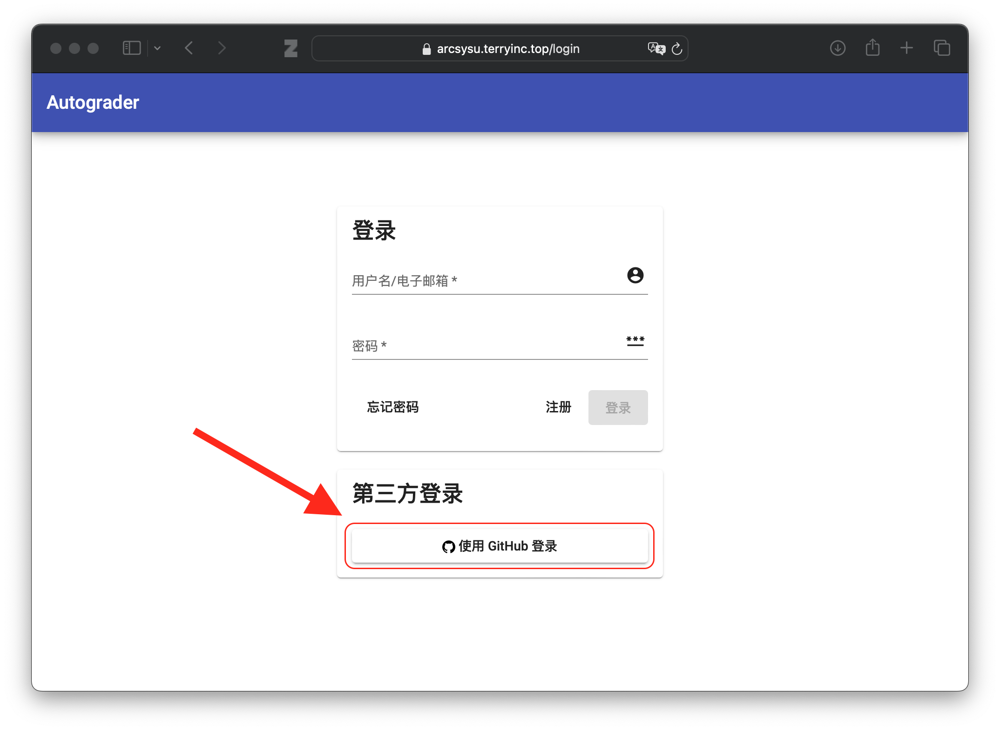
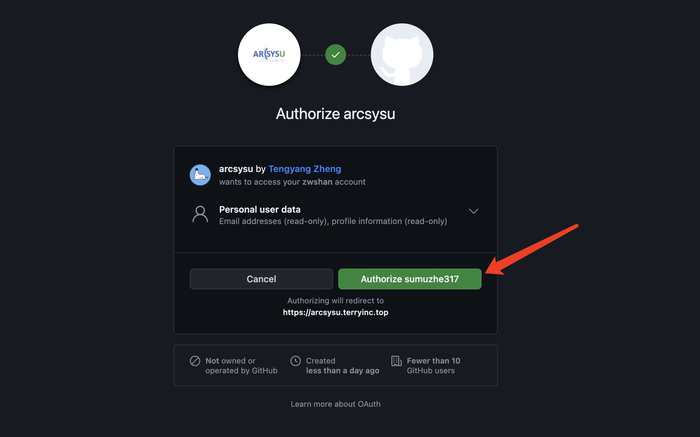
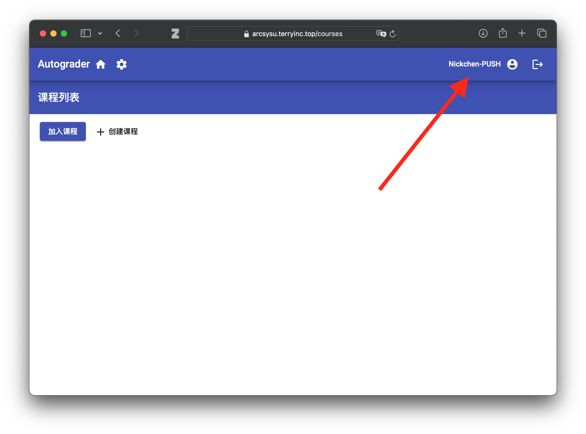
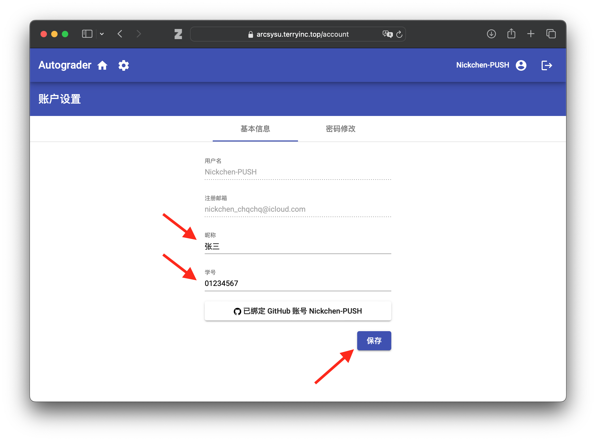
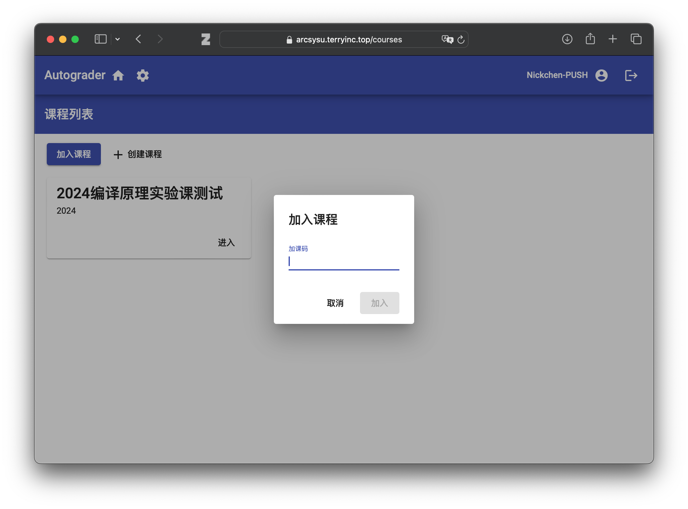
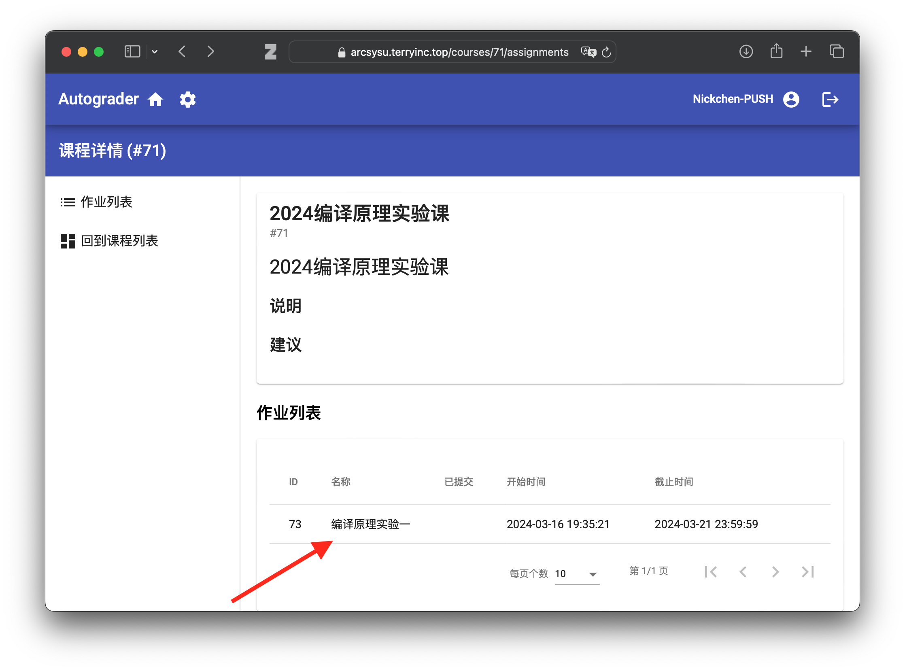
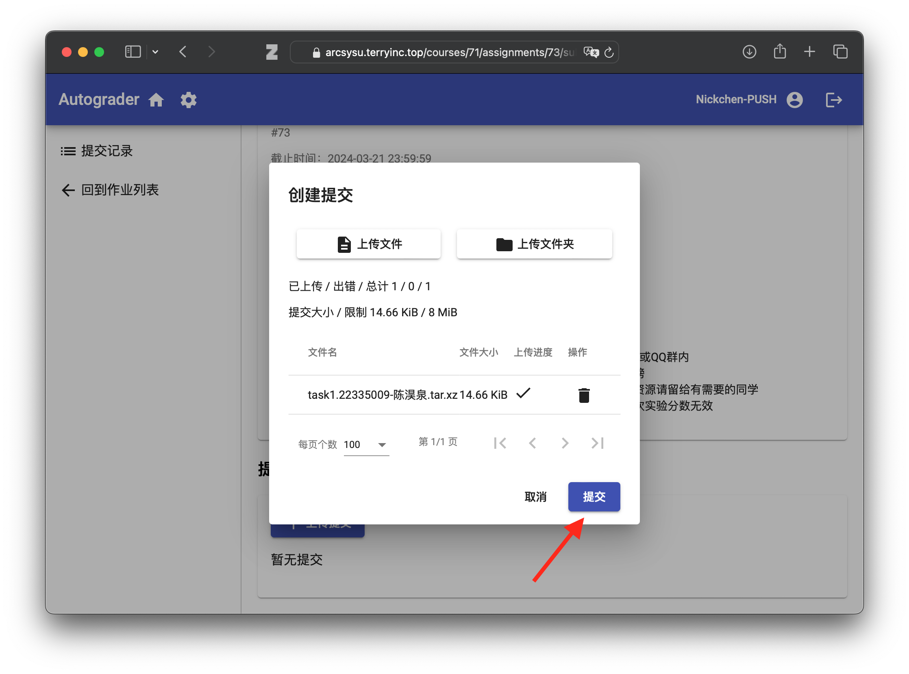
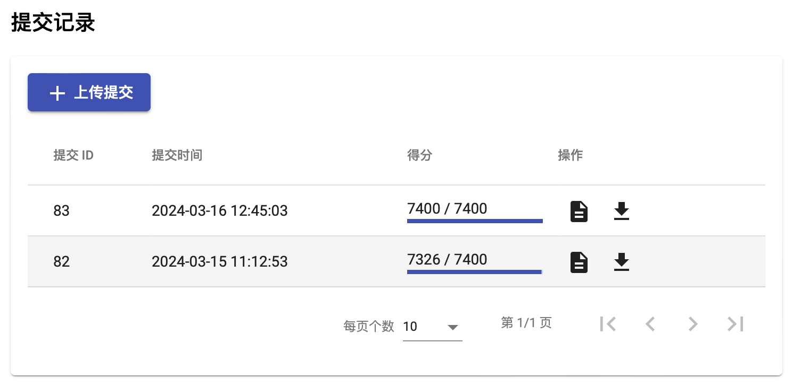
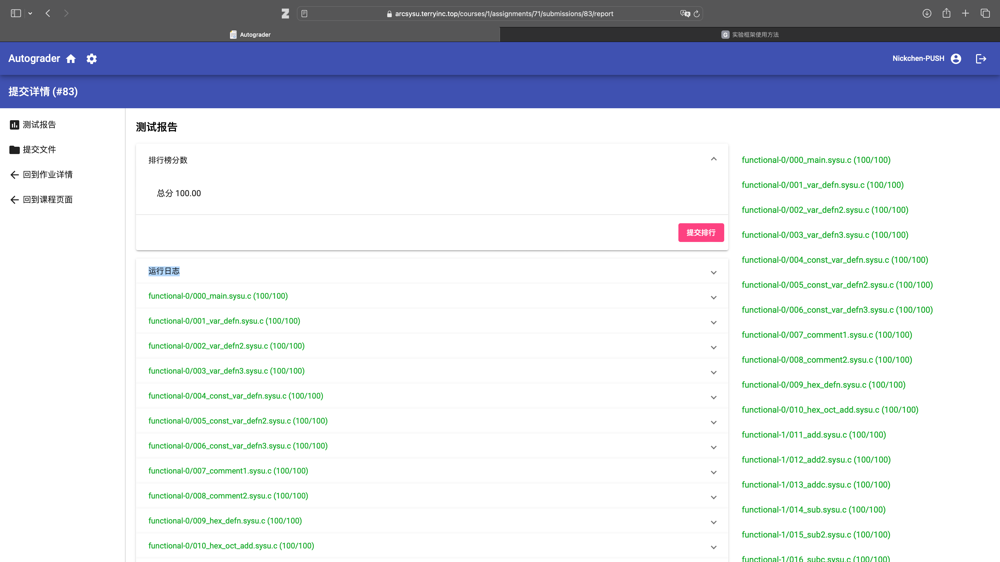

# 在线评测系统使用方法

**SYsU-lang(2.0)** 的在线评测系统基于**Autograder**构建。**Autograder** 是一款为项目型大作业设计的智能评分系统。其提供了评测机搭建、项目作业评分，以及网页服务的一站式综合解决方案。

#### 注意事项

在提交在线评测前，检查你是否

1. 在本地成功运行评测
2. 按照实验文档提示进行了打包，压缩包文件名称与本人信息相符，大小不超过**8192KB**
3. 注册了**Github**账号（如果你还没有 **Github** 账户的话，是时候注册一个啦！）

---

#### 在线评测系统网址

[https://arcsysu.terryinc.top/](https://arcsysu.terryinc.top/)
加课码：**D4Y4NAFD**

#### 登录界面

打开在线评测系统后，登录界面如下图所示。**请使用 Github 登陆** (暂不支持使用邮箱注册)

打开 Github 认证界面后，登录你的 Github 账号，并点选 `Authorize XXX`

成功认证登录后，将会显示**Autograder**的菜单如下。点击右上角头像处设置账户信息。将 `昵称`设置为你的真实姓名，`学号`设置为你的学号。

（如果你在认证登录遇到问题，你可以尝试配置网络代理）

点击保存后回到主页，点击 `加入课程`，输入加课码 **D4Y4NAFD** 加入课程。

成功加入课程并刷新网页后，在主页可以看到 `2024编译原理实验课`，点击进入课程，可以看到实验一的提交入口已经开放。点击进入作业提交界面。

在作业提交界面中，依次点击 `上传提交`->`上传文件` 并选取先前打包的压缩包。上传成功后，点击 `提交`。

提交成功后，评测机会开始评测。评测完成后，在 `提交记录`可以查看评测结果和评测报告

---

#### 常见问题🙋

1.添加实验报告后，压缩包大小超过了8192KB

    解决方法：评测系统不要求上传实验报告，去除实验报告重新打包提交即可。（注：提交到**超算习堂**的压缩包需包含实验报告）
