# 环境配置
在本小节中，我们会带领同学们完成实验环境配置。为了尽可能地还原同学们环境配置的过程，这里采用一台从来没有进行过开发的新电脑进行演示。


## 软件安装
由于大部分同学都是使用 `Windows` 电脑进行开发，所以这里采用Windows11系统进行演示。首先需要同学们下载并安装以下三种软件。由于 `Windows` 系统下 `docker` 的正常使用需要 `WSL` 环境，所以请同学们在安装 `docker` 之前先安装 `WSL`。(对于 `linux` 系统和  `mac` 系统的同学而言，只需要跳过 `WSL` 的安装即可)。

需要安装的软件如下：

- WSL2
- git
- Docker（可选）
- VSCode

### WSL2 安装

WSL 是 Windows Subsystem for Linux 的简称，它是微软在 Windows 操作系统上提供的一个功能，允许用户在 Windows 环境下运行 Linux 应用程序和命令行工具。简单来说，它让你可以在 Windows 系统中享受到 Linux 的强大功能。这里我们需要安装 WSL2，由于 WSL1 与 WSL2 采用不同架构，如果使用 WSL1，Docker 引擎将无法在 WSL 内运行。

首先同学们需要打开 `控制面板〉程序〉启动或关闭 Windows 功能`，开启 `容器`（Windows 11 特有）、`适用于 Linux 的 Windows 子系统`、`虚拟机平台` 这三个功能。

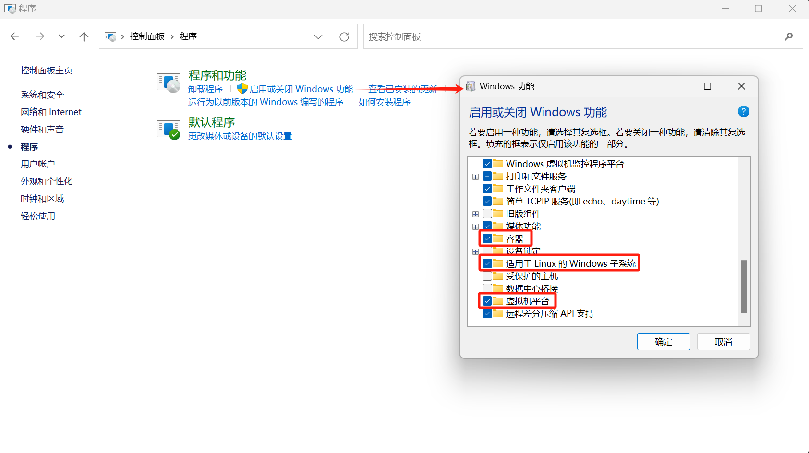


接著用**管理员权限**打开终端命令行，在其中输入以下代码，等待其安装即可。已安装 WSL 的同学请检查安装的 WSL 版本是否为2，使用 WSL1 的同学需自行将版本升级，或创建一个新的 WSL2 系统。

```shell
wsl -l -v                       # 列举所有已安装的 Linux 系统
wsl --set-default-version 2     # 设置 WSL 默认版本号为2
wsl -d Ubuntu --install         # 安装 Ubuntu 系统
```


打开 Windows 终端机，在页签的右边有个下拉选单，点击后会出现刚才安装的 Ubuntu 系统，再点击就会在 WSL2 开启终端了。

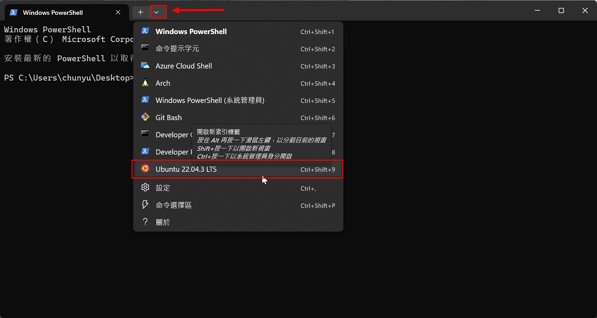

### git 安装

其次是 git 的安装，git 是一个开源的分布式版本控制系统，用于有效地处理从小到大的项目版本管理。同学们直接在[官方网站](https://git-scm.com/downloads)下载，并进行图形界面的安装即可。

### Docker 安装

Docker 可以将代码、运行所需的运行时、系统工具和库进行打包成镜像。助教们已经将实验所需的开发环境打包成镜像，这可以使得同学进行实验代码开发的环境和我们助教开发实验时保持一致，减少了同学们环境配置的繁琐操作。**如果同学们使用[可选方案 1](#可选方案-1-⸺-dev-containers-自动配置需安装-docker)进行环境配置，就必须安装 Docker 才能启用 Dev Containers 功能。**

在 Windows 有两种 Docker 安装方式，第一种是直接在 [Docker 官网](https://www.docker.com/products/docker-desktop/)下载 Docker Desktop，并进行图形界面的安装即可；第二种是在 WSL2 中的 Ubuntu 安装 Docker 引擎，同学们可以在命令行输入下面命令安装，或是参阅 [Docker 官方文档](https://docs.docker.com/engine/install/ubuntu/)进行安装。

```bash
# 导入 Docker 官方仓库 GPG 密钥:
sudo apt-get update
sudo apt-get install ca-certificates curl
sudo install -m 0755 -d /etc/apt/keyrings
sudo curl -fsSL https://download.docker.com/linux/ubuntu/gpg -o /etc/apt/keyrings/docker.asc
sudo chmod a+r /etc/apt/keyrings/docker.asc

# 添加 Docker 仓库到 Apt 源:
echo \
  "deb [arch=$(dpkg --print-architecture) signed-by=/etc/apt/keyrings/docker.asc] https://download.docker.com/linux/ubuntu \
  $(. /etc/os-release && echo "$VERSION_CODENAME") stable" | \
  sudo tee /etc/apt/sources.list.d/docker.list > /dev/null
sudo apt-get update

# 安装 Docker 
sudo apt-get install docker-ce docker-ce-cli containerd.io docker-buildx-plugin docker-compose-plugin
```

上面两种方式的区别在于 docker 命令的作用域不同，第一种方法可以直接在 Windows 命令行使用 `docker` 指令，第二种需要在 WSL2 命令行才能使用 `docker` 指令。

<!-- 请通过以下命令检查 docker 服务是否处于启动状态或者启动 docker 服务，如果显示类似如下图片中`active(running)`，则表示 docker 服务已经启动。

```bash
systemctl status docker  #查看 docker 状态
systemctl start docker   #启动 docker 服务
```
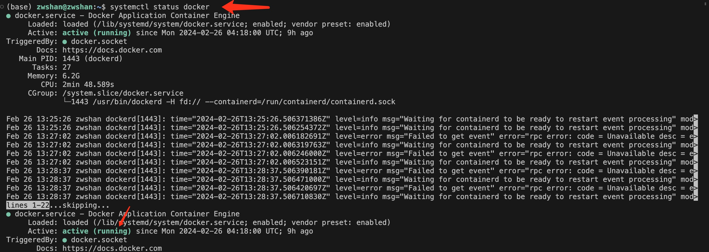 -->

在同学们安装好 Docker 之后，可以通过docker的图形化界面来确认docker服务的启动状态

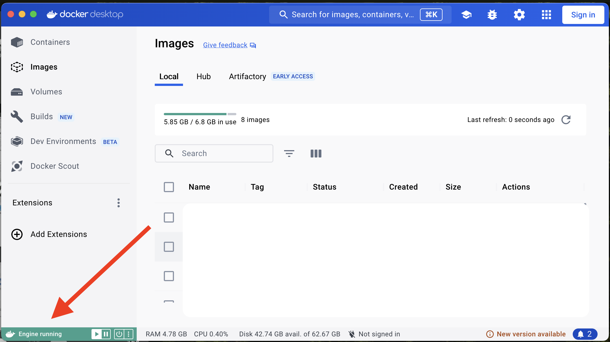


### VSCode 安装

最后是 VSCode 的安装，VSCode 是一款可以安装多种强大插件的开源代码编辑器，如果同学们选择 VSCode 作为本次实验的代码编辑器，助教提前设计好的工作流将大幅提升你的开发效率。如果同学们选择其他代码编辑器将不能享受到这样的福利。VSCode 直接在[官方网站](https://code.visualstudio.com/)下载，并进行图形界面的安装即可.


## 可选方案 1 ⸺ Dev Containers 自动配置（需安装 Docker）

此章节的步骤分为两种，取决于同学们前面[安装 Docker](#docker-安装) 的方式，如采用第一种方式安装Docker的同学，请继续往下看，如果是用第二种方式安装 Docker 的同学，请跳至[从 WSL2 启动 Dev Containers](#从-wsl2-启动-dev-containers) 继续操作。

同学们打开 VSCode 之后需要点击下图红色三角形所示的按钮，进入到插件管理界面搜寻 `Dev Containers` 进行插件安装。


请同学们确保 Docker 服务处于**启动状态**后，请点击 VSCode 左下角的红色箭头所指的齿轮，然后再点击另外红色箭头所指的按钮打开 Command Palette，或使用快捷键 `Ctrl+Shift+P` 叫出 Command Palette。

<!-- 请打开[实验 github 仓库页面](https://github.com/yhgu2000/SYsU-lang)，点击 `fork` 按钮，


然后同学们会看到出现以下界面，大家可以取一个自己喜欢的仓库名字，然后点击`create fork`


出现如下界面则意味着同学们已经完成仓库 `fork`

 -->


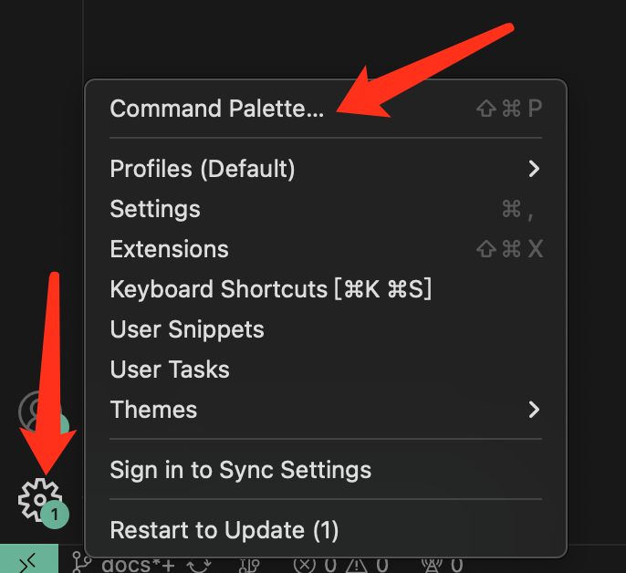

此时在 VSCode 的顶部居中位置会出现如下图所示的内容，请同学们在出现的搜索栏中输入 `Dev Containers` 关键词，然后大家需要点击下图红色三角形所示的按钮 `Dev Containers: Clone Repository in Container Volume`。

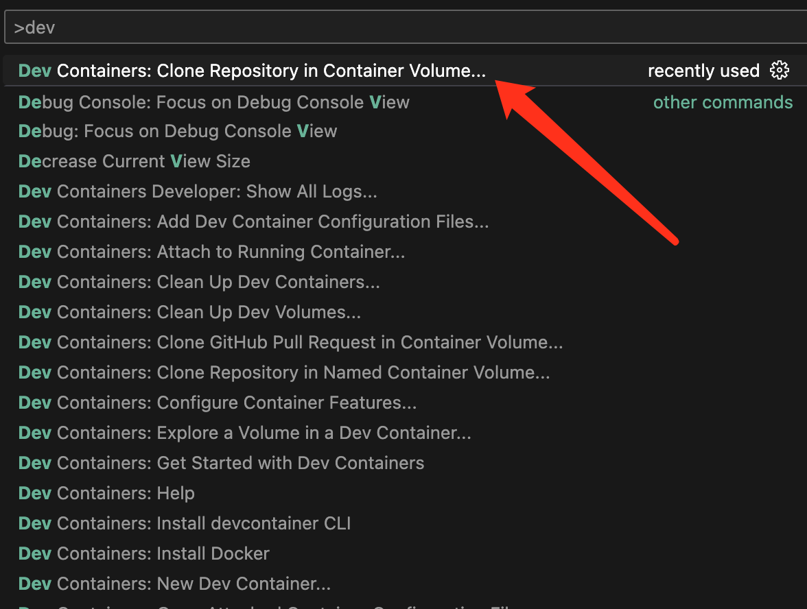

然后需要同学们在如下所示的界面输入实验仓库地址 `https://github.com/arcsysu/SYsU-lang2`，并且点击 `Clone git repository form URL` 按钮。


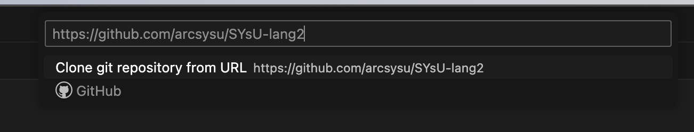


<!-- 在这个时候 vscode 会出现下图所示的窗口提示同学们登录自己的 github 账号，请同学们点击下图中所示的`github`按钮


接着会出现如下图所示的窗口要求同学们确认是否同意该插件使用 github 账号进行登录，请同学们点击确认。


如果同学们的浏览器保存了 github 的登录信息，那么会出现下图所示的一个会话窗口，请同学们点击打开 vscode 即可。（如果同学们的浏览器没有保存 github 登录信息，需要多一个输入 github 账号密码进行登录的步骤）


成功授权 github 登录信息之后，同学们的电脑会回到 vscode 的界面，弹出如下所示窗口。请同学们选择前面我们 fork 到自己账号下的的实验代码仓库，选择主分支。

 -->

此时 VSCode 便会自动开始实验环境的搭建与配置。点击右下角的 show log 即可观察环境配置进度,

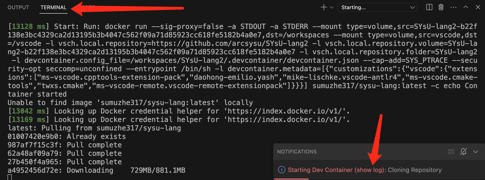

待同学们观察到上图所示的进度条达到100%或者消失，并且出现如下图所示的界面。使用 Dev Containers 进行自动构建的环境的操作就完成了。

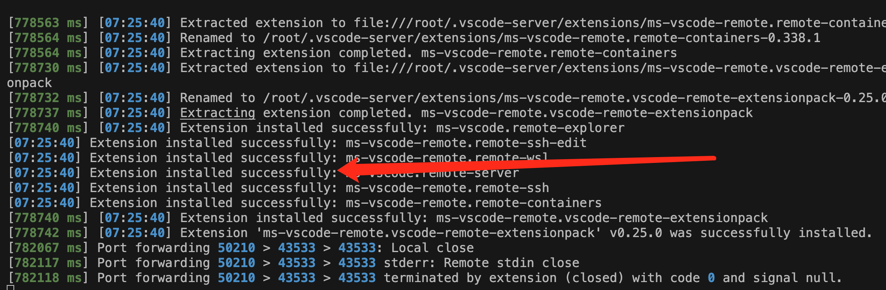

如果在 Dev Container 配置时由于网络不稳定原因导致 Docker 镜像拉取失败，同学们可以尝试以下操作后重新进行 Dev Container 配置：

```bash
# 使用命令行删除镜像缓存（也可以通过 Docker Desktop 界面删除镜像缓存）
docker rmi sumuzhe317/sysu-lang:latest  # 删除本地缓存的实验镜像
docker rmi vsc-volume-bootstrap:latest  # 删除本地缓存的 bootstrap 镜像

# 从校内镜像源重新拉取镜像，并对镜像重命名
docker pull docker.mirrors.matrix.moe/sumuzhe317/SYsU-lang:latest &&
docker pull docker.mirrors.matrix.moe/vsc-volume-bootstrap:latest && 
docker tag docker.mirrors.matrix.moe/sumuzhe317/sysu-lang:latest sumuzhe317/sysu-lang:latest &&
docker tag docker.mirrors.matrix.moe/vsc-volume-bootstrap:latest vsc-volume-bootstrap:latest

# 若无法连接至校内镜像源，可使用 Docker 代理镜像源进行拉取
docker pull dockerproxy.com/sumuzhe317/sysu-lang:latest &&
docker tag dockerproxy.com/sumuzhe317/sysu-lang:latest sumuzhe317/sysu-lang:latest &&
docker rmi dockerproxy.com/sumuzhe317/sysu-lang:latest
```

如果顺利的话，vscode 的顶部还会弹出如图所示的窗口来提示同学们选择项目所示的编译器，请同学们选择箭头所示的 clang14 即可。

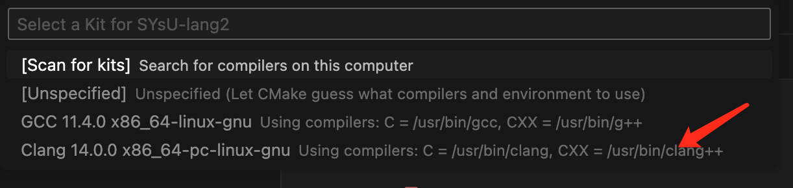

### 从 WSL2 启动 Dev Containers

同学们如果使用第二种方式安装 Docker，配置步骤会稍显不同。首先我们需要打开 Windows 终端机进入 WSL2 命令行界面。


在命令行中输入下面命令把实验仓库源码 clone 下来。

```bash
git clone git@github.com:arcsysu/SYsU-lang2.git
```

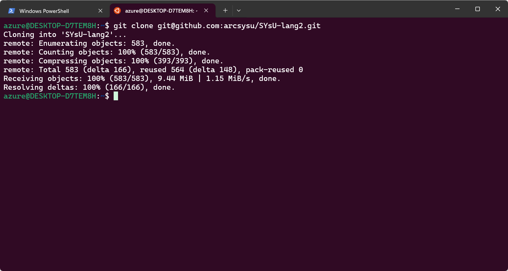

此时当前目录下会多一个 `SYsU-lang2` 目录，命令行输入 `code SYsU-lang2` 用 VSCode 开启该目录。

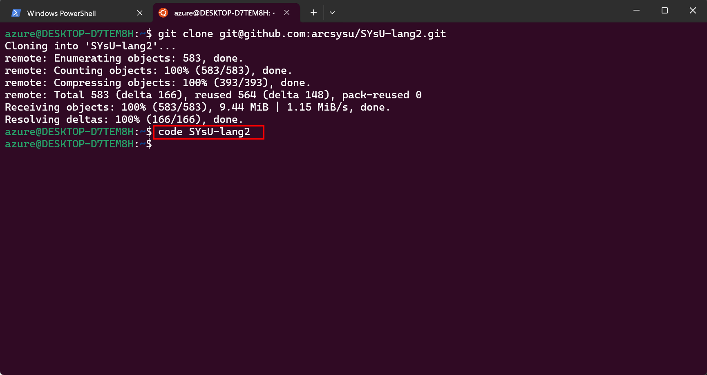

如果先前在 WSL 环境中未安装过 Dev Container 插件，先到插件管理界面搜寻 Dev Containers 安装插件。

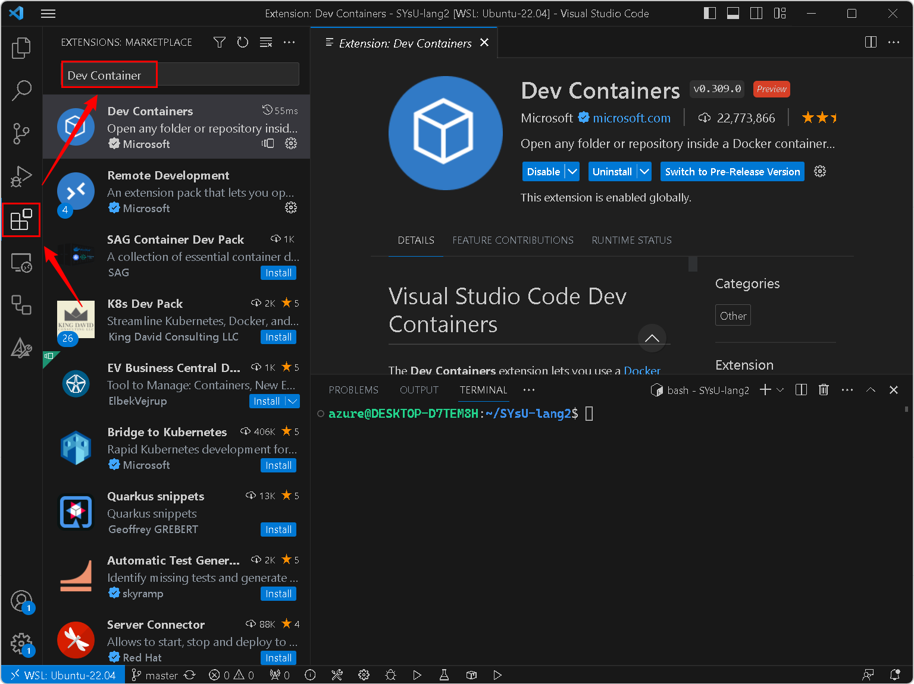

如果已经安装 Dev Containers，用 VSCode 开启 `SYsU-lang2` 目录后右下角会显示 Dev Containers 的提示，点击 `Reopen in Container` 按钮会自动进行环境配置。

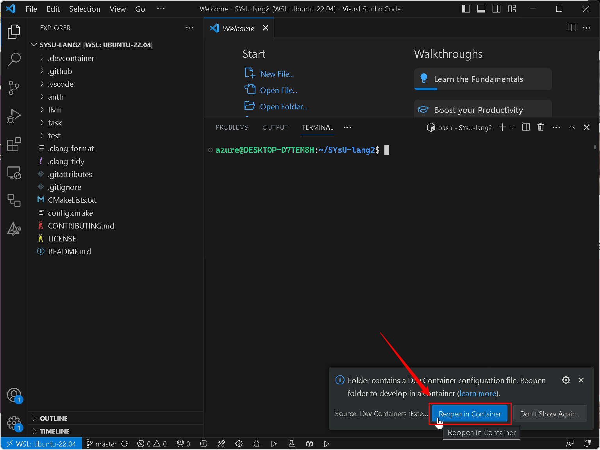

配置完成后，点击左侧 Remote Explorer 按钮进入 Remote Exploer 管理界面，下拉选单选择 `Dev Containers` 会出现刚才配置好的容器，点击中间的 `Open in Container in New Window` 就会开启配置好开发环境的 VSCode 工作区，同学们下次要进入工作区只需要在 WSL 开启 VSCode，从这个界面进入就行了。


点击左侧 CMake 图标，在 Configure 可以设置项目使用的编译器，请同学们选择 Clang 14。

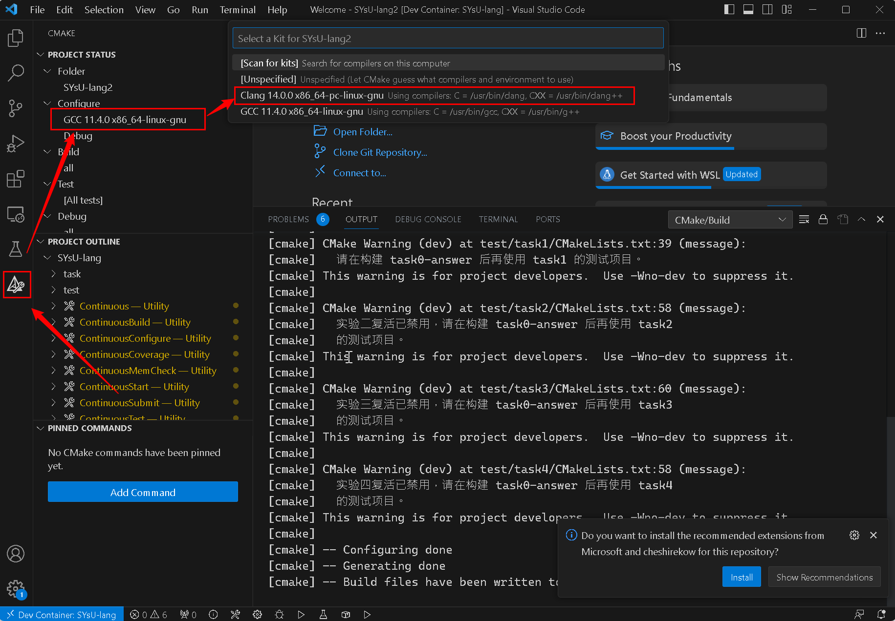

### 注意事项

1. 在配置 Dev Containers 环境时，我们要避免在 Windows 环境下直接克隆仓库或使用网站下载仓库代码，然后直接在 VSCode 选择 `Dev Containers: Reopen in Container` 进行搭建。由于 Windows 文件系统性能不如 Linux 文件系统，这种做法会导致容器和代码文件处于不同的操作系统中，在执行命令时产生巨大的性能开销。建议使用上文所述的 `Dev Containers: Clone Repository in Container Volume` 选项，让 VSCode 帮助我们自动下载仓库代码并安装容器。
2. 在搭建 Dev Containers 时若出现网络问题，请检查本机（包括WSL2）代理是否开启以及 git 代理是否配置，并尝试在打开/关闭代理后重新搭建。

<!--  -->
## 可选方案 2 ⸺ 命令行手动配置（使用 Docker）
首先请同学们启动 vscode 软件，并安装 `Dev Container` 插件

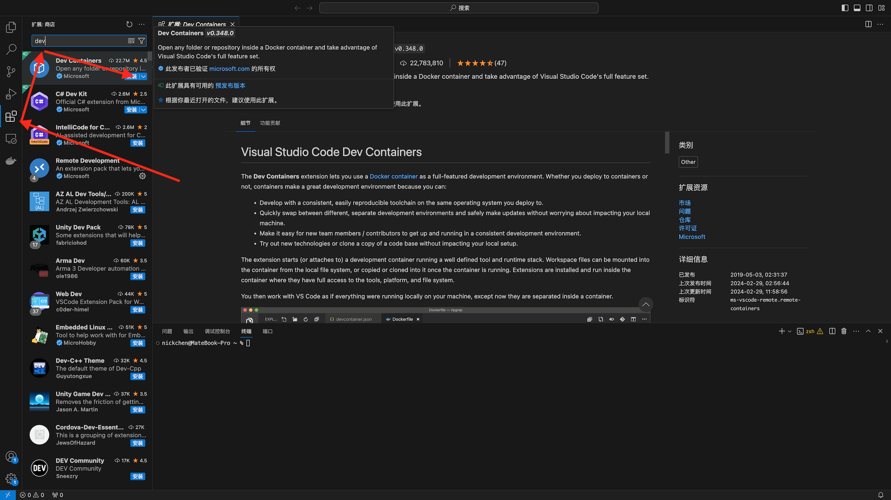

点击下图所示的按钮新建一个命令行终端。

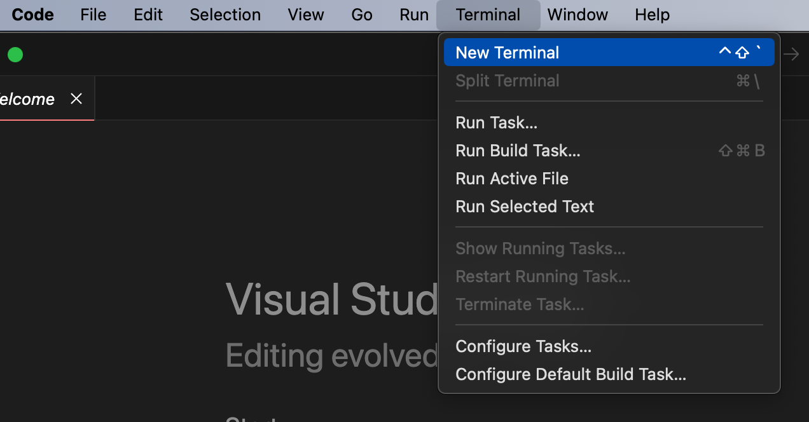

如果同学们使用的是 Windows 系统，在这里需要输入以下命令进入 WSL，如果使用的是 Mac 系统或者是 Linux 系统可以直接进行后续步骤。

```bash
wsl
```

接下来，为避免软件版本冲突以及影响同学们的系统环境，推荐同学们在 docker 内进行本实验环境配置。

<!-- 所以需要同学们在终端输入如下命令中的一条查看 docker 服务状态或者启动 docker 服务
```bash
systemctl status docker  #查看 docker 状态
systemctl start docker   #启动 docker 服务
```

 -->

同学们可以先通过docker desktop来确认docker服务的启动状态

如果确认 docker 已经是运行状态则可以进行下一步操作。在命令行窗口输入以下命令进行 ubuntu 镜像的拉取。
```bash
docker pull ubuntu:22.04
```
出现以下输出字样则代表镜像拉取已经完成：

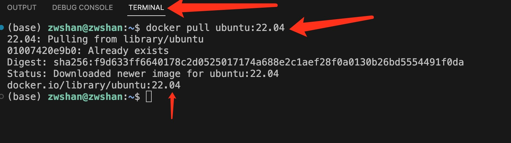

之后，我们需要将拉取下来的 ubuntu 镜像实例化为一个容器，并在容器内进行实验环境的配置。  

```bash
docker run -it --name labdemo ubuntu:22.04
# docker run是运行 Docker 容器的命令
# -it 是两个选项的结合。-i 表示交互式操作，允许用户与容器进行交互，-t 表示分配一个伪终端（pseudo-TTY）。这使得用户可以在容器内执行命令，并且能够与命令行进行交互。
# --name labdemo表示将运行的容器命名为 labdemo
```

当同学们在命令行看到`root@xx`等字样时意味着成功将镜像实例化为了容器

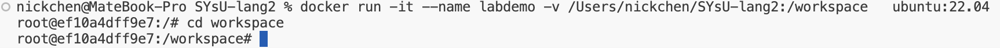

之后，请使用 `Dev Container` 插件将 vscode 连入容器，如果遇到“容器未在运行”的问题，在弹出窗口或者 `docker desktop` 启动容器便可。

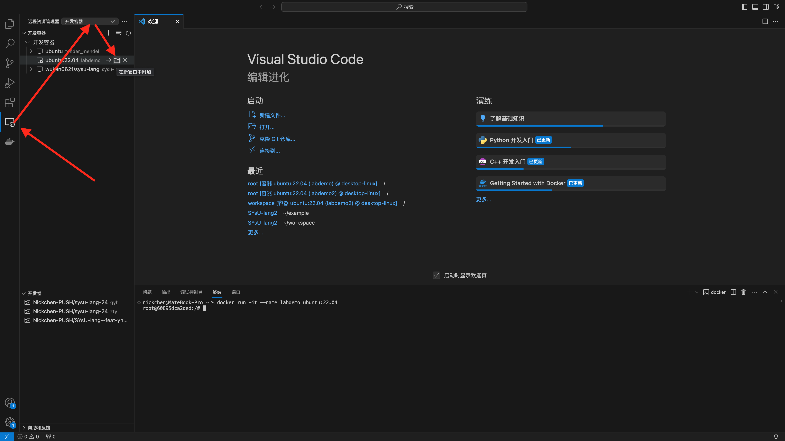

在成功使用 `Dev Container` 连入 `docker` 容器之后，同学们需要在容器内进行实验环境的搭建，安装一些实验必需的应用软件。首先需要同学们在当前窗口新建终端，并输入以下命令安装必要的软件：
```bash
apt update # 更新软件包列表信息
apt install -y ninja-build clang-14 wget cmake xz-utils unzip g++ lld flex bison git # 下载软件

#以下是上述软件的简要介绍   
# ninja-build    一个用于加速软件编译速度的软件   
# clang-14       安装实验必需的一个编译器   
# wget           一个Linux 系统下的下载软件，类似迅雷在 win 的地位   
# cmake          一个开源的跨平台的构建工具，用于自动生成各种不同编译环境下的构建脚本，帮助管理和构建 C/C++ 项目。   
# xz-utils       一个解压软件   
# unzip          正如其名   
# g++            实验必需的编译器   
# lld            实验必需的链接器   
# flex           词法分析器构造工具   
# bison          文法分析器构造工具   
```

然后，我们需要将实验代码远程仓库拉取到本地。请同学们在当前窗口新建命令行终端，并在终端输入以下命令。当命令行显示如下`100%  xx done`字样时代表仓库拉取已经完成。此时在命令行输入 `ls` 命令可以看到`SYsU-lang2`实验代码文件夹。  

```bash
git clone https://mirror.ghproxy.com/https://github.com/arcsysu/SYsU-lang2

# `https://mirror.ghproxy.com/`是一个github 代理，方便解决可能存在的 github 访问不稳定问题
```
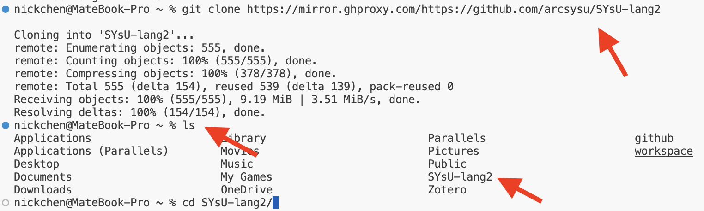

请同学们输入以下命令进入实验代码仓库，并且查看实验代码仓库路径。  
```bash
cd SYsU-lang2  # 进入文件夹
pwd            # 查看当前路径
```
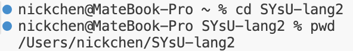
<!-- 
之后，请在 `vscode` 的左侧界面点击 `open folder`，并选择前文中我们通过 `pwd` 命令获取的路径

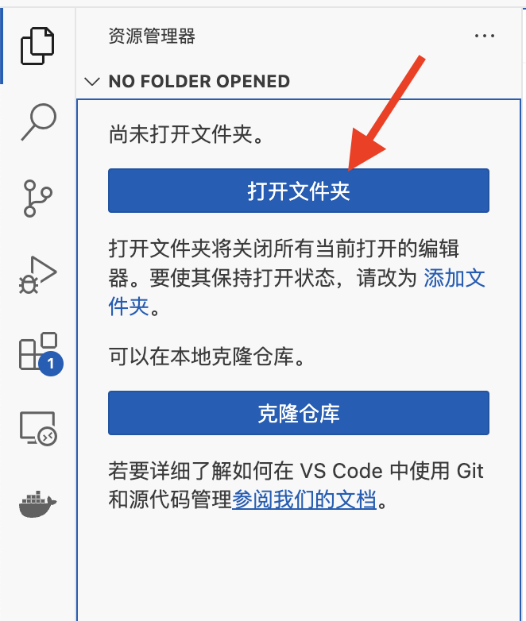

成功后，`vscode` 的左侧便会出现一个如下图所示的文件资源管理器，方便同学们进行图形界面的操作。  

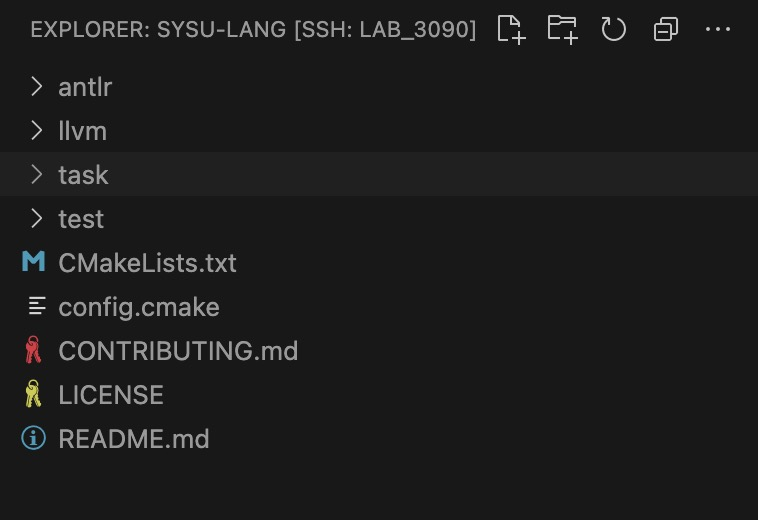   -->

之后，请同学们输入以下命令进行另外两个特殊软件的安装,两种软件在对应文件夹下都有助教提前写好的自动化编译安装脚本。**请确保终端当前的目录在实验代码仓库根目录下。**  

首先是llvm软件
```bash
cd llvm && bash install.sh
```
成功安装后的界面如下图所示,

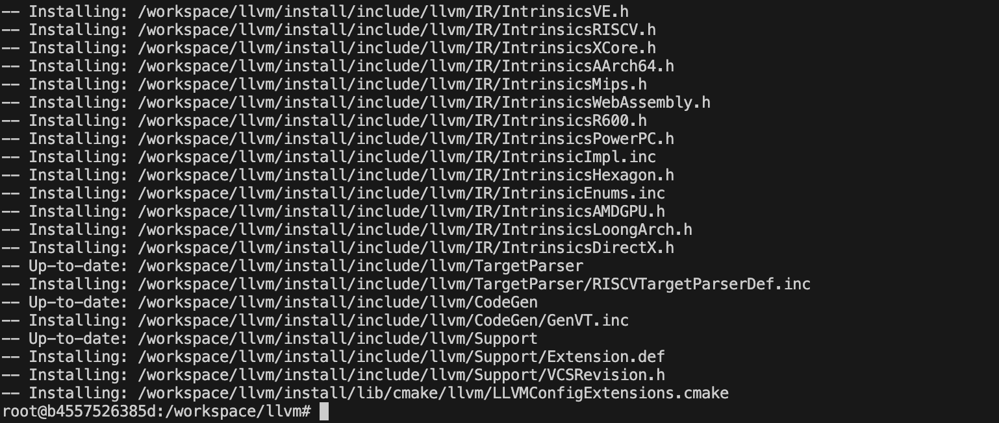

接下来是 antlr 软件的安装，请大家在命令行输入如下命令。
```bash
cd ../    # 回到实验代码仓库根目录(可选)
cd antlr && bash install.sh
```
成功编译安装后的界面如下图所示,

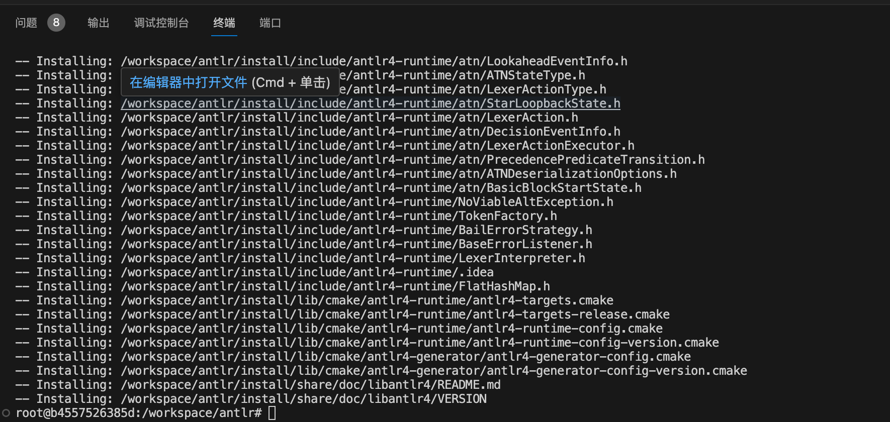

注意⚠️：因为编译是计算密集型任务，此步骤耗时可能较长，如果你不能成功编译，你可以尝试以下的方法：

1. 重新编译，输入以下指令以重新编译(以llvm为例)  

```bash  
cmake --build build --target clean
cmake llvm -B build -G Ninja\
  -DCMAKE_BUILD_TYPE=Release \
  -DCMAKE_INSTALL_PREFIX=$(realpath install) \
  -DLLVM_ENABLE_PROJECTS="clang" \
  -DLLVM_TARGETS_TO_BUILD="X86" \  
  -DLLVM_USE_LINKER=lld \
  -DLLVM_INCLUDE_BENCHMARKS=OFF \
  -DLLVM_INCLUDE_EXAMPLES=OFF \
  -DLLVM_INCLUDE_TESTS=OFF
cmake --build build --target install
```


2. 在Docker Desktop中为你的容器增加Memory limit/Swap，并重新编译。如果你使用的是Windows+wsl，方法可能会有所不同。详情可参阅docker内的提示。


在以上 linux 系统软件安装完成之后，我们还需要在容器内安装一系列 vscode 插件，以便更方便地进行实验代码的编写。请同学们按照以下所示的方法，打开 vscode 的插件安装界面。

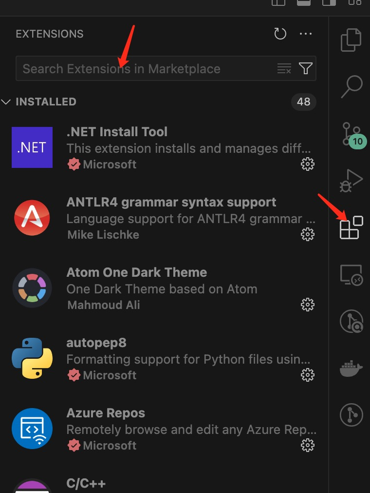

需要安装的 vscode 插件名字列表如下：
- C/C++
- C/C++ extension pack
- CMake
- CMake Tools
- ANTLR4 grammar syntax support
- Yash

你也可以打开筛选以快速找到这些插件  

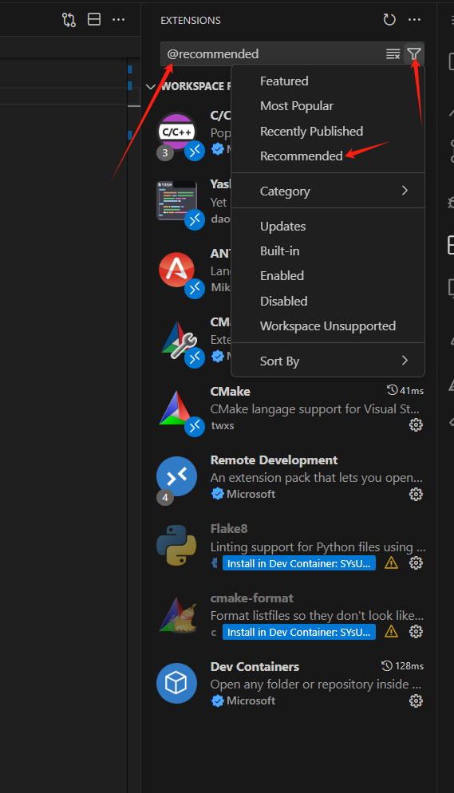  

当前面所提到的 linux 系统软件以及 vscode 插件全部安装完成后，就完成了手动配置实验环境。

## 可选方案 3 ⸺ 命令行手动配置（不使用 Docker）  
前言：如果处于以下的情况，你可以尝试此配置方案
1. 你遇到了难以解决的问题，以上方案都无法配置实验环境
2. 你希望能在操作系统为 Linux/MacOS 的机器上原生运行该实验

该方案假定你对 Linux/Unix 系统基本操作，软件安装，cmake使用等方面有一定了解，并且要求你的操作系统为 Linux/MacOS 。如果你遇到任何问题，你可以先尝试自己解决，再来向助教团队求助。以下教程的示例均以 MacOS 为例，并会注明 Linux 上的等效操作。  

注意⚠️：无论你使用什么方法配置实验环境，你都需要保证你提交的代码能在评测机上正确运行。

前置要求：
1. 操作系统：Linux/MacOS
2. VSCode
3. Git
4. Xcode命令行工具 (MacOS)

目录：
1. 拉取实验代码仓库
2. 使用包管理器下载安装必备软件
3. 编译安装llvm、antlr，或直接使用llvm提供的二进制包
4. 配置vscode和cmake  
5. 常见问题

### 拉取实验代码仓库  
在你的终端中输入以下指令以拉取实验代码仓库,并通过vscode打开仓库文件夹  

```bash
git clone https://mirror.ghproxy.com/https://github.com/arcsysu/SYsU-lang2
code SYsU-lang2
```

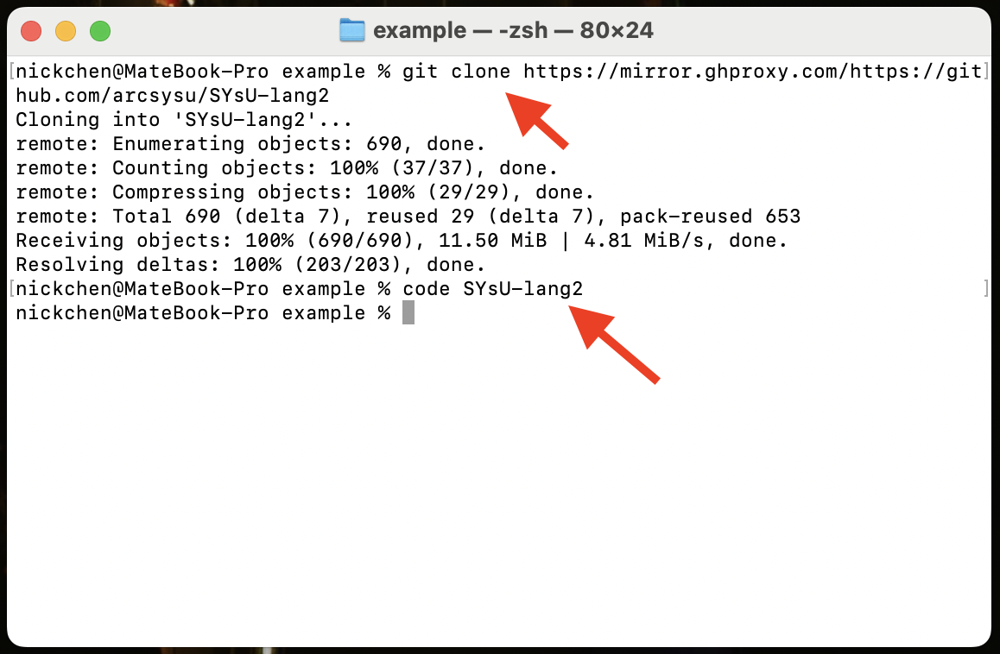
成功打开vscode后将如下所示
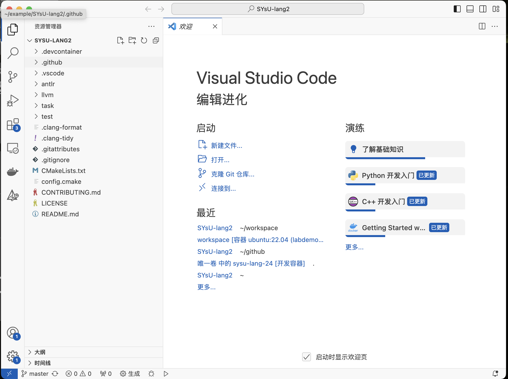

### 使用包管理器下载安装必备软件  
在vscode中打开终端，使用你的包管理器下载以下软件，在Linux上的包管理器通常是 `apt` ，这里我使用的是MacOS上常用的 `brew`

```bash
# MacOS
brew install ninja wget cmake flex bison xz # 下载软件

# Linux
apt update # 更新软件包列表信息
apt install -y ninja-build clang-14 wget cmake xz-utils unzip g++ lld flex bison git # 下载软件

#以下是上述软件的简要介绍   
# ninja          一个用于加速软件编译速度的软件   
# clang-14       安装实验必需的一个编译器   
# wget           一个Linux 系统下的下载软件，类似迅雷在 win 的地位   
# cmake          一个开源的跨平台的构建工具，用于自动生成各种不同编译环境下的构建脚本，帮助管理和构建 C/C++ 项目。   
# xz-utils       一个解压软件   
# unzip          正如其名   
# g++            实验必需的编译器   
# lld            实验必需的链接器   
# flex           词法分析器构造工具   
# bison          文法分析器构造工具   
```

### 编译安装llvm、antlr，或直接使用llvm提供的二进制包
在上述软件成功安装之后，请大家输入以下命令进行另外两个特殊软件的安装,两种软件在对应文件夹下都有助教提前写好的自动化编译安装脚本。但由于MacOS不支持 `lld` 链接器，直接使用cmake编译安装llvm源文件会报错，这里推荐直接使用官网提供的二进制包。  

注意⚠️：将 `/your/path/to/SYsU-lang2` 改为你的仓库目录所在路径
#### llvm
MacOS: 

```bash
cd /your/path/to/SYsU-lang2/llvm

wget https://github.com/llvm/llvm-project/releases/download/llvmorg-17.0.6/clang+llvm-17.0.6-arm64-apple-darwin22.0.tar.xz # 根据你的架构选择，这里是使用Apple Silicon的机器

tar -xJvf clang+llvm-17.0.6-arm64-apple-darwin22.0.tar.xz # 解压

rm -rf install # 确保你的 /llvm 目录下没有其它名为 install 的文件夹

mv clang+llvm-17.0.6-arm64-apple-darwin22.0 install # 重命名,这一步非常关键
```

Linux
```bash
cd /your/path/to/SYsU-lang2/llvm && bash install.sh
```
Linux成功安装后的界面如下图所示,


接下来是 antlr 软件的安装，请大家在命令行输入如下命令。

MacOS & Linux

```bash
cd /your/path/to/SYsU-lang2/antlr && bash install.sh
```
成功编译安装后的界面如下图所示,


### 配置vscode和cmake  

在以上软件安装完成之后，我们还需要安装一系列 vscode 插件，以便更方便地进行实验代码的编写。请同学们按照以下所示的方法，打开 vscode 的插件安装界面。


需要安装的 vscode 插件名字列表如下：
- C/C++
- C/C++ extension pack
- CMake
- CMake Tools
- ANTLR4 grammar syntax support
- Yash

你也可以打开筛选以快速找到这些插件  

  

当CMake Tools插件安装完成后，点击删除缓存并重新配置，当看到 “xx done" 字样时，你就成功完成配置了🎉
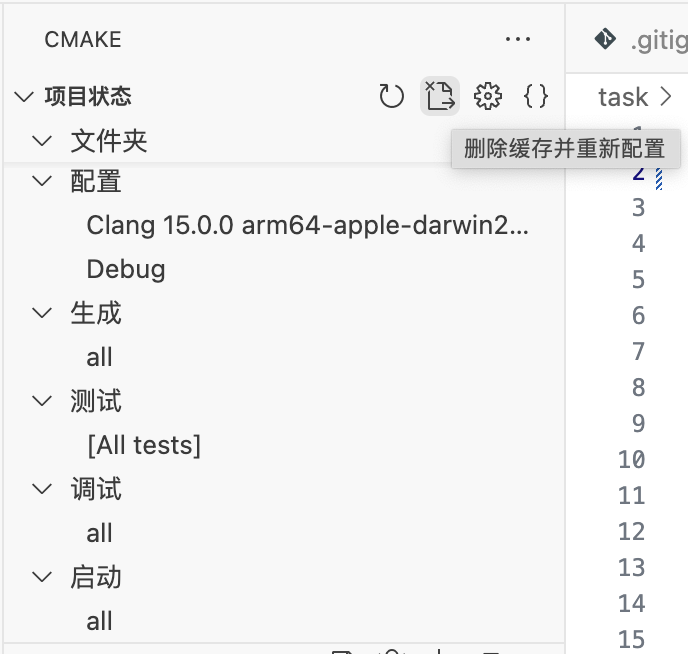

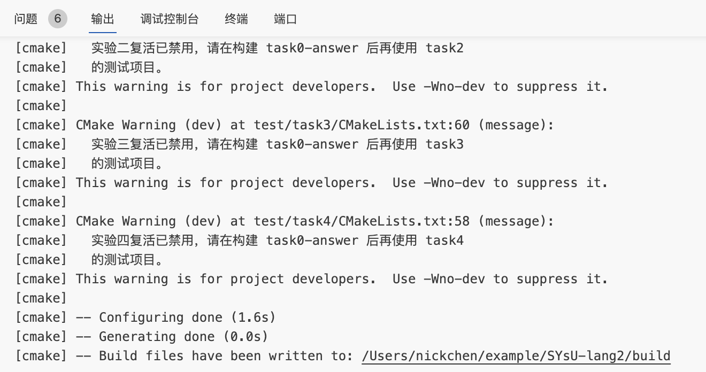

### 常见问题
1. 在MacOS下，cmake 找不到 brew 安装的 bison  

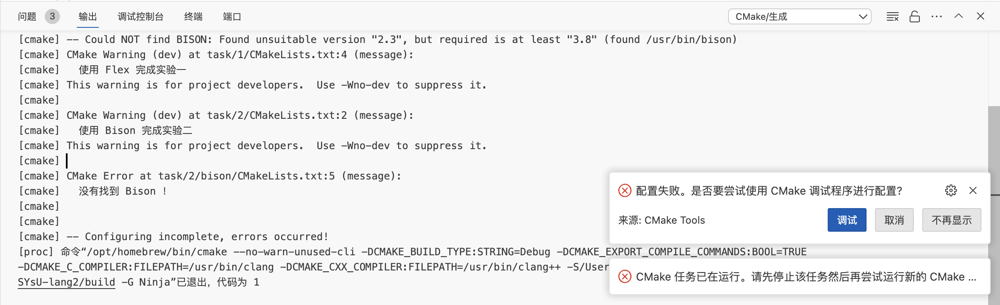  

解决方法：将 `task/CMakeLists.txt`中第2行的`find_package(BISON 3.8)`改为`find_package(BISON)`

2. MacOS如何安装Xcode命令行工具？  
解决方法：在 app store 中直接安装Xcode，同时也会安装Xcode命令行工具。