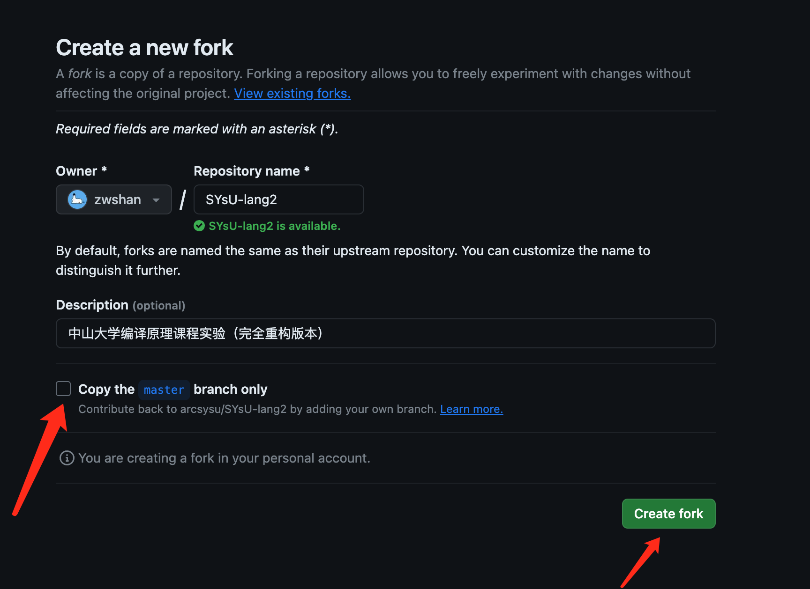
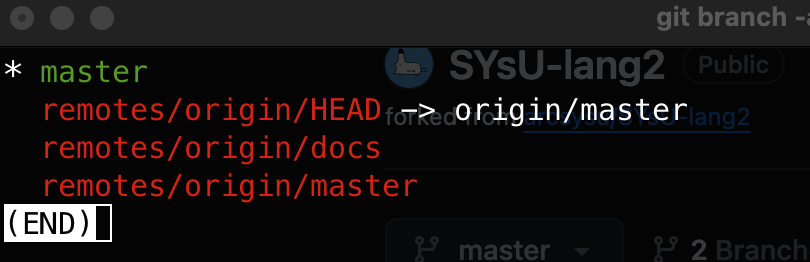
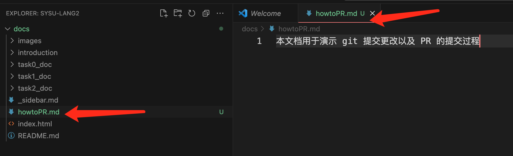
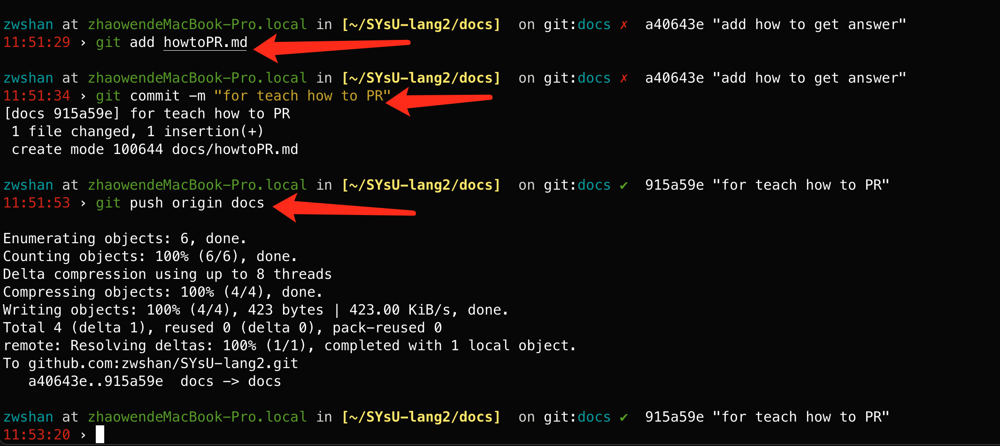
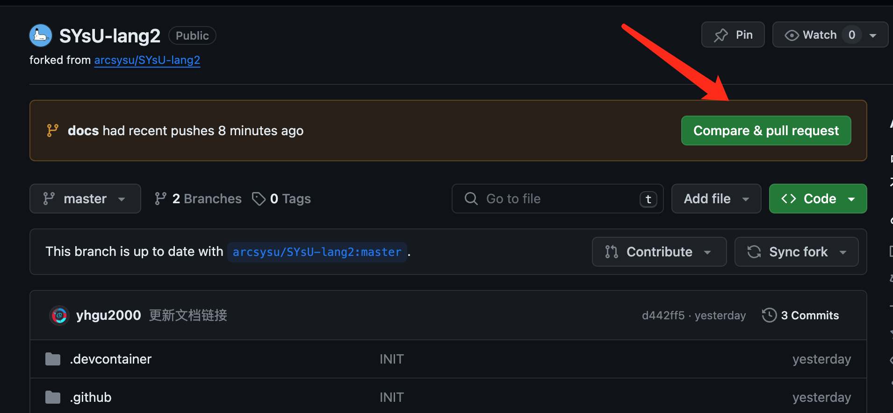
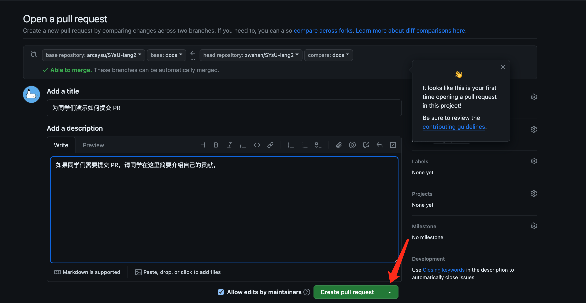

# 帮助我们改进实验
助教们非常认真地进行了实验设计，并且认真编写了实验文档，我们非常希望我们的实验能够让同学们满意并且能够有收获。但是我们深知我们做得还不够，我们认为正在进行实验的的你们。对于实验以及文档应该如何改进具有最大的发言权，所以我们诚邀同学们加入到实验的建设中来。在本节中我们会向同学们介绍如何对我们的实验做出贡献，也就是同学们会学习到如何为一个开源项目做贡献————为一个开源仓库提`pull request`的方法。

其中的步骤分为以下三步，我们会依次进行介绍：
- 将实验仓库 fork 到自己的账户下
- 将自己 fork 的仓库 clone 本地进行代码或者文档修改
- 对修改后的代码进行 push 并提交 PR

## 将代码 fork 到自己账户
首先请同学们在浏览器打开[项目仓库网址](https://github.com/arcsysu/SYsU-lang2)，点击下图所示的`fork`按钮。


然后会弹出下图所示的界面，请同学们记得将`Copy the master branch only`取消掉（因为我们的实验代码和实验文档位于两个不同的分支），再点击`create fork`按钮



最后弹出如下图所示的界面即代表完成了fork。


## 对代码做修改并上传
请注意由于实验项目仓库的属性是`public`，`fork`后的仓库需与原仓库保持同样的属性才能够正常发起`PR`，所以请同学们不要将自己的实验代码答案`push`到你`fork`的仓库中去，以避免你的实验答案泄露。

由于前面同学们已经对实验环境完成了配置，所以同学们可以在之前配置好的环境中进行代码修改（因为代码修改需要环境测试是否编译正常等，文档修改则不需要），然后把你的修改复制到这边你 clone 的仓库中进行 push，下面以对文档修改并提交 PR 进行演示。

首先请你在命令行进入对 fork 后的仓库进行clone
```
git clone https://github.com/zwshan/SYsU-lang2-test
```
待 clone 完成之后 cd 到文件夹内，并且进行实验分支的查看
```bash
cd SYsU-lang2-test
git branch -a
```
会出现如下图所示的界面，可以看到存在一个docs的分支，在这个界面下，同学们可以在英文输入法状态按`q`键退出。



接下来请同学们输入以下命令将远端的docs分支拉取到本地的docs分支
```bash
git checkout -b docs remotes/origin/docs
```
输入命令后命令行会提示以下内容代表切换成功。
```bash
branch 'docs' set up to track 'origin/docs'.
Switched to a new branch 'docs'
```

以下示例图片中的`howtoPR.md`位于刚刚 clone 的 fork 到我们个人账号下的文件中，
是一个为了向同学们演示如何提交 PR 而新建的文档。



接下来请同学们输入以下命令将本地仓库中的文件 push 到我们 fork 的远端 github 仓库中。
```bash
git add howtoPR.md
git commit -m "for teach how to PR"
git push origin docs
```
最终同学们可以看到下图所示的结果，代表成功上传。



此时进入到自己账户下找到之前我们 fork 的实验仓库，同学们可以看到如下的提示，请点击`compare & pull request`



然后会显示下图所示界面，点击`create pull request`即可完成 PR 的提交。




