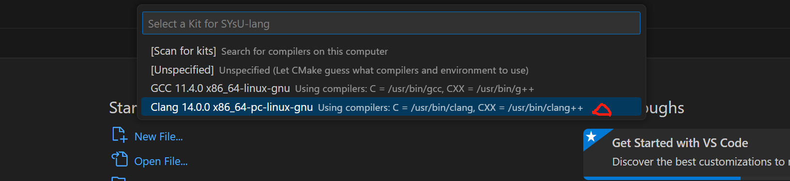
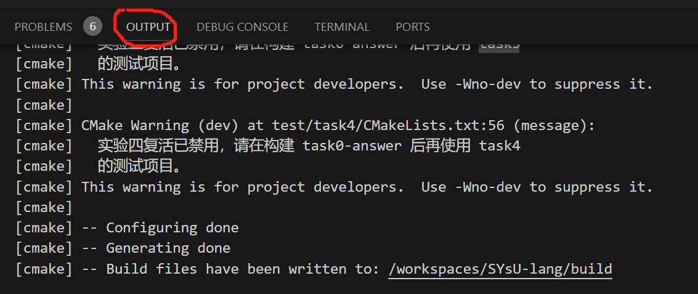
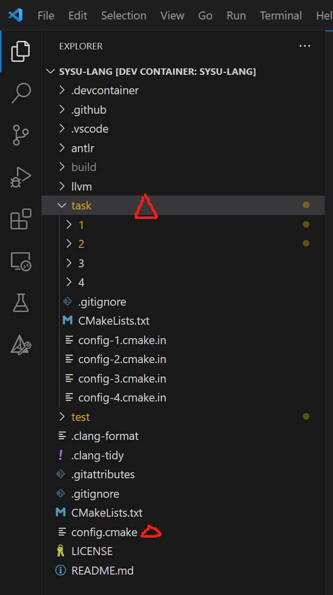
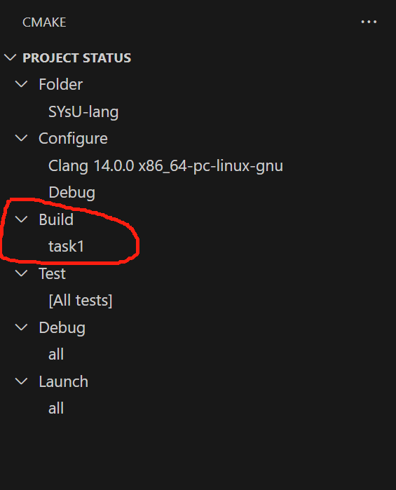
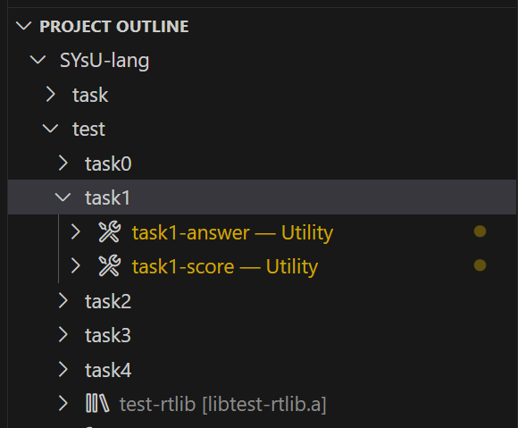

# 实验框架使用方法
在前面环境搭建的文档中我们提到了如果同学们使用我们提供的 vscode + dev containers 对实验项目进行构造，同学们将体会到使用助教提前编辑好的脚本的便利，在本节中我们将对如何使用我们的实验框架进行详细的介绍。

## 如何编译构建项目
请同学们首先点击左侧插件菜单栏中的CMAKE按钮进入到如下图所示的界面，然后请同学们点击`Delete Cache and Reconfigure`这个按钮进行项目代码的构建。


此时vscode会弹出如下窗口要求你对编译此项目的编译器进行选择，请大家选择我们提前安装好的Clang即可。



如果最终在output一栏中显示`XX done`即可认为同学们已经成功完成了项目构建。




## 如何做实验
虽然实验项目如下存在很多的文件夹，但是同学们最需要关心的只有`task`文件夹下的内容以及`config.cmake`



在`config.cmake`的开头存在着以下一段代码，同学们需要在这段代码中填入你的学号和姓名。在这里实验一和实验二我们提供了多种完成的方式，同学们需要使用了某种方式进行实现之后，在使用上一小节介绍的方法进行编译构建之前，需要将你选择进行实现方法填入对应的地方。此外，下面这段代码中还提到了一个词`复活`，我们默认将复活设置为开启。我们设计的实验是前后连贯的，前一个实验的输出结果有可能是后一个实验的输入，但是我们考虑到同学们可能存在上一个实验精力不济无法取得满分的情况。在这种情况下开启`复活`，可以使得当前实验的输入不受上一个实验的输出影响（此时当前实验的输入结果为助教提前设计好的标准输入）

```
# 你的学号
set(STUDENT_ID "0123456789")
# 你的姓名
set(STUDENT_NAME "某某某")

# 实验一的完成方式："flex"或"antlr"
set(TASK1_WITH "flex")

# 实验二的完成方式："bison"或"antlr"
set(TASK2_WITH "bison")
# 是否在实验二复活，ON或OFF
set(TASK2_REVIVE OFF)

# 是否在实验三复活，ON或OFF
set(TASK3_REVIVE OFF)

# 是否在实验四复活，ON或OFF
set(TASK4_REVIVE OFF)
```

当前同学们开始做实验进行编码时，只需要打开`task`目录下的对应实验文件夹进行编码即可，其中每一个实验文件夹下面的代码结构会由对应章节进行介绍。假设此时同学们已经完成了实验一的编码，想要对代码进行编译与测试。
- 第一步点击左侧插件菜单中的`CMAKE`
- 第二个将Build目标设置为TASK1（你可以需要把鼠标滚轮向下滑一点才能找到TASK1）



然后在`project outline`中点击`task1-answer`以及`task1-score`。其中前者会生成`task1`的标准输出，后者会给出同学们的代码所对应的分数。



其中`标准输出`以及`自己实现的代码对应的输出`同学们可以在`/workspaces/SYsU-lang/build/test/task1`对应测试样例文件夹下面看到，方便同学们比对`DEBUG`


## 如何调试代码
（目前通过主分支上的代码存在一个问题，没有预先安装VSCODE的C++插件，这会导致debug无法正常运行，进行测试的助教请手动安装一下）
前面提到了同学们可以通过肉眼比对自己的输出和标准输出来进行debug，但也可能会存在肉眼比对找不到bug的情况。由于助教在设计实验的过程中已经把调试配置文件编写完成，所以同学们可以直接进行图形界面的调试。
我以实验一的flex版本实现为例进行介绍。首先我在`main.cpp`如图所示位置打了断点。


然后在`PROJECT STATUS`处将`DEBUG`配置为`task1`


然后点击左侧插件菜单栏中的量杯按钮`TESTING`。这里假设我实验一的第一个测试样例就没能正常通过，点击如下图所示的debug按钮即可进入调试的图形界面。


