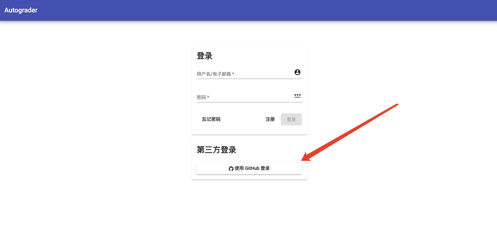
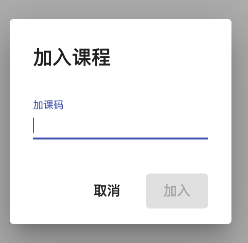
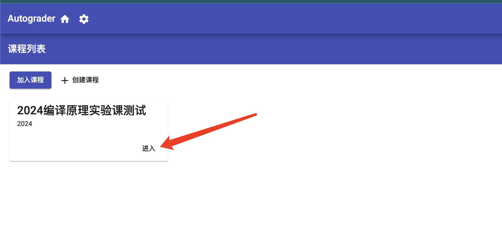
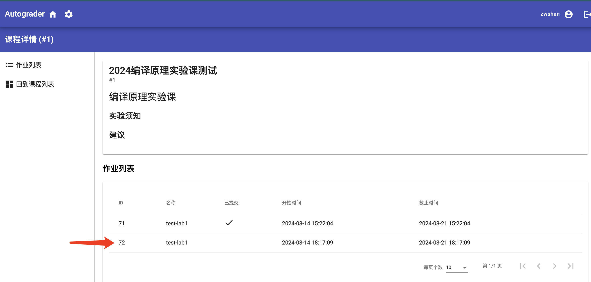
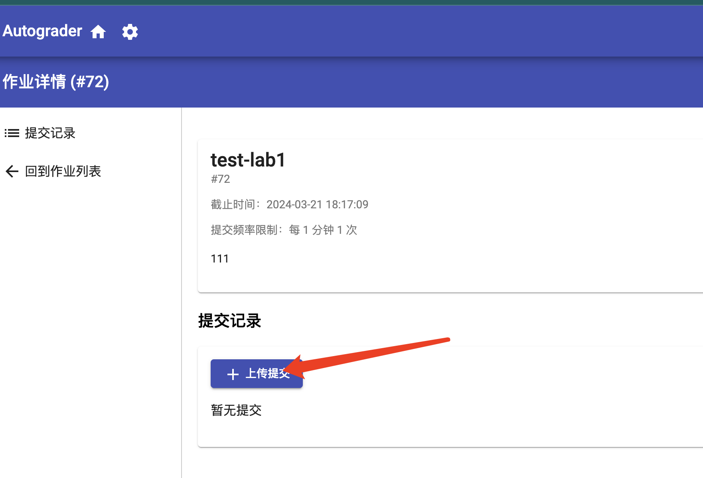

# 评测服务器使用方法

首先请同学们输入以下网址进入到评测服务器页面：
```
https://arcsysu.terryinc.top/login
```

然后需要同学们点击下图所示界面的`使用 Github 登录`按钮（如果你还没有 `github` 账户的话，是时候注册一个啦！）



如果你的浏览器缓存了你的`github`账号登录信息(如果没有缓存，只需要你再登录一下 `github` 账户即可)，你将会看到如下图所示的界面


请点击`authorize sumuzhe317`进行授权登录即可，然后正常情况下浏览器将会自动跳转到课程界面。请同学们点击左上角的`加入课程`按钮


然后在弹出的界面中输入我们提供的课程代码



你的课程列表主页此时会出现一个新的课程(这里以我们的测试课程为例)，此时请你点击进入。



然后在以下界面选择一个你要提交的实验对应的评测任务



接下来同学们会看到如下界面，点击上传提交我们打包的项目代码即可。



在这里再次介绍一下我们的实验代码打包方式，请同学按照以下截图方式进行即可。（因为在其他地方也有介绍过。）


