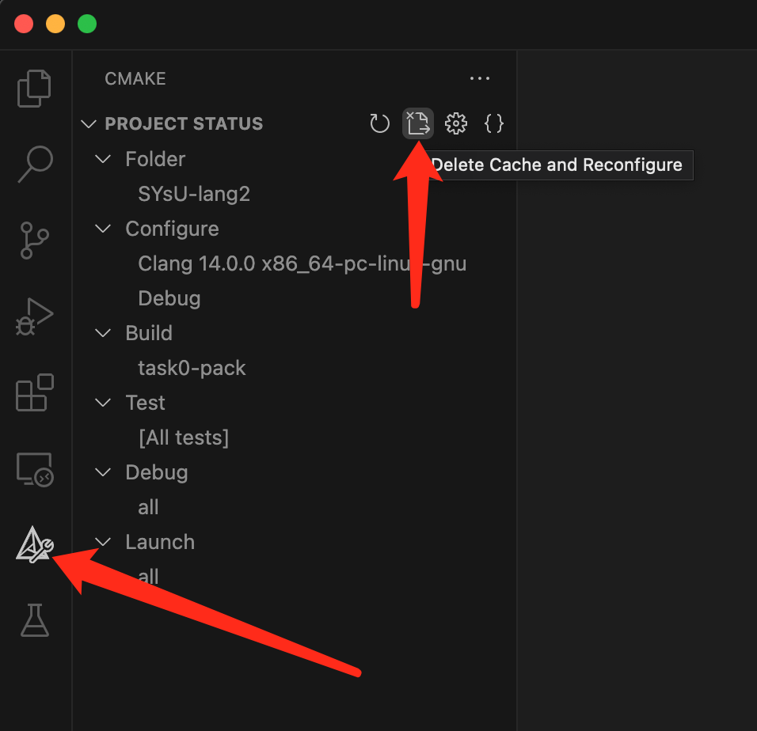
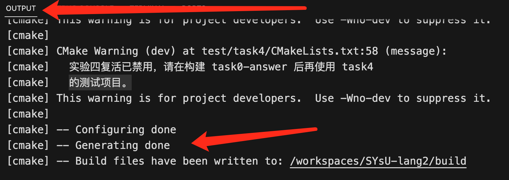
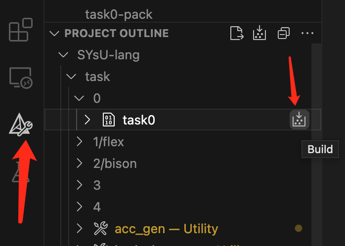
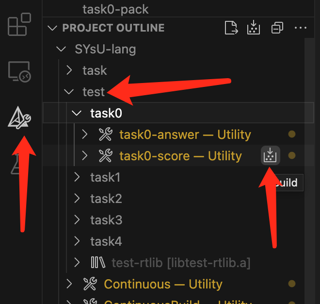
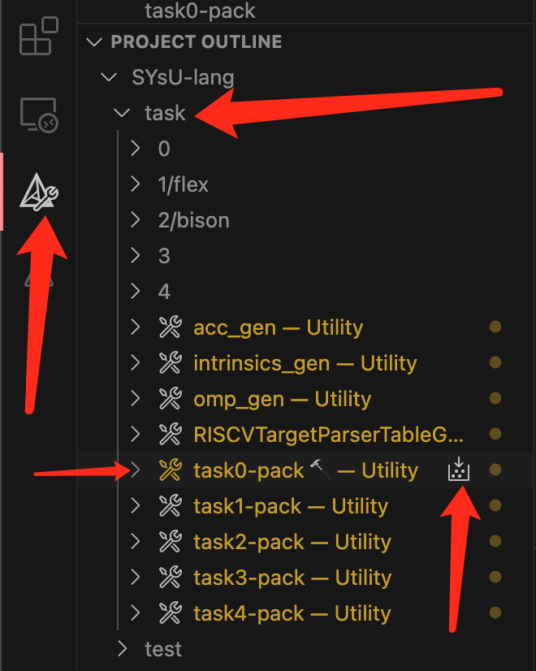

# 实验内容
实验 0 存在的目的是保证每一位同学都已经配置好了实验环境并且学会了使用实验框架，首先请同学们完成实验项目的配置。实现项目配置包括确定编译器版本、工具可用性、库文件位置等操作。要完成实验项目配置，同学们首先需要点击左侧插件菜单栏中的CMAKE按钮进入到如下图所示的界面，然后请同学们点击`Delete Cache and Reconfigure`这个按钮进行项目代码的配置。



此时vscode会弹出如下窗口要求你对编译此项目的编译器进行选择，请大家选择我们提前安装好的Clang即可(如果同学们之前选择过编译器这里就不会弹出窗口)。


如果最终在output一栏中显示`XX done`即可认为同学们已经成功完成了项目构建。




## 1. 构建 `task0` 
请同学们按照下图所指引完成`task0`的构建，



当 vscode 输出栏中显示如下内容时代表构建成功。
```bash
[main] Building folder: SYsU-lang2 task0
[build] Starting build
[proc] Executing command: /usr/bin/cmake --build /workspaces/SYsU-lang2/build --config Debug --target task0 --
[build] ninja: no work to do.
[driver] Build completed: 00:00:00.029
[build] Build finished with exit code 0
```

## 2. 构建 `task0-score`
请同学们按照下图所指引完成`task0-score`的构建，获得 task0 的实验成绩，



如果获得以下类似的输出代表操作正确。
```bash
[main] Building folder: SYsU-lang2 task0-score
[build] Starting build
[proc] Executing command: /usr/bin/cmake --build /workspaces/SYsU-lang2/build --config Debug --target task0-score --
[build] [1/1   0% :: 0.000] cd /workspaces/SYsU-lang2/build/test/task0 && /usr/bin/python3.10 /workspaces/SYsU-lang2/test/task0/score.py /workspaces/SYsU-lang2/build/test/task0 /workspaces/SYsU-lang2/build/task/0/task0
[build] task0 总分:100.0
[build] 
[build] task0    100.00/100.00  Hello, SYsU-lang!
[build]   
[build] 
[driver] Build completed: 00:00:00.045
[build] Build finished with exit code 0
```

## 3. 构建 `task0-pack`



同时输出窗口会输出打包好的代码文件到指定路径，方便同学们后续上传到评测机进行代码评测。
```bash
[main] Building folder: SYsU-lang2 task0-pack
[build] Starting build
[proc] Executing command: /usr/bin/cmake --build /workspaces/SYsU-lang2/build --config Debug --target task0-pack --
[build] [1/1 100% :: 0.008] cd /workspaces/SYsU-lang2/task && /usr/bin/cmake -E tar cvfJ /workspaces/SYsU-lang2/build/task/task0.0123456789-某某某.tar.xz /workspaces/SYsU-lang2/task/0 && echo 作业已打包，请提交\ '/workspaces/SYsU-lang2/build/task/task0.0123456789-某某某.tar.xz'\ 到评测服务器。 && echo 作业已打包，请提交\ '/workspaces/SYsU-lang2/build/task/task0.0123456789-某某某.tar.xz'\ 到评测服务器。 && echo 作业已打包，请提交\ '/workspaces/SYsU-lang2/build/task/task0.0123456789-某某某.tar.xz'\ 到评测服务器。
[build] 0
[build] 0/README.md
[build] 0/config.cmake
[build] 0/main.cpp
[build] 0/CMakeLists.txt
[build] 作业已打包，请提交 /workspaces/SYsU-lang2/build/task/task0.0123456789-某某某.tar.xz 到评测服务器。
[build] 作业已打包，请提交 /workspaces/SYsU-lang2/build/task/task0.0123456789-某某某.tar.xz 到评测服务器。
[build] 作业已打包，请提交 /workspaces/SYsU-lang2/build/task/task0.0123456789-某某某.tar.xz 到评测服务器。
[driver] Build completed: 00:00:00.029
[build] Build finished with exit code 0
```

