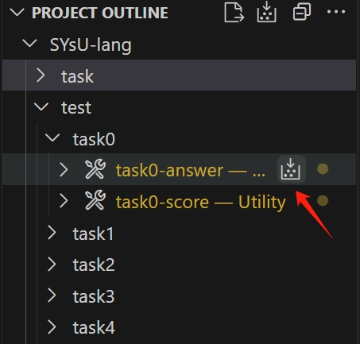
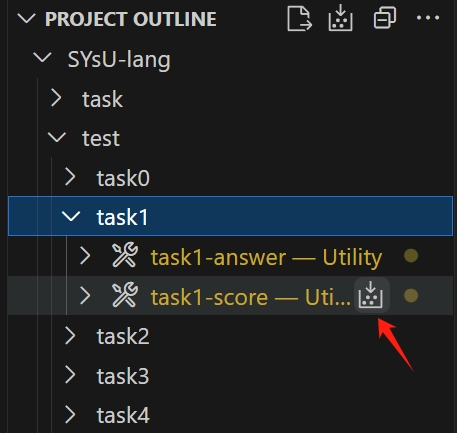

# Task1 总体介绍
本次实验的实验内容是实现一个简单的词法分析器。下面通过一个简单但直观的例子向大家介绍本次实验的主要内容。

文件`build/test/task0/basic/000_main.sysu.c`中的代码如下所示：

```c++
# 1 "./basic/000_main.sysu.c"
# 1 "<built-in>" 1
# 1 "<built-in>" 3
# 384 "<built-in>" 3
# 1 "<command line>" 1
# 1 "<built-in>" 2
# 1 "./basic/000_main.sysu.c" 2
int main(){
    return 3;
}

```

上面这段代码已经是`clang`预处理后的结果。在同学们完成完成实验零之后，将上面这段代码输入到同学们实现的词法分析器之后，会得到如下内容（词法分析的结果）：

```c++
int 'int'	 [StartOfLine]	Loc=<./basic/000_main.sysu.c:1:1>
identifier 'main'	 [LeadingSpace]	Loc=<./basic/000_main.sysu.c:1:5>
l_paren '('		Loc=<./basic/000_main.sysu.c:1:9>
r_paren ')'		Loc=<./basic/000_main.sysu.c:1:10>
l_brace '{'		Loc=<./basic/000_main.sysu.c:1:11>
return 'return'	 [StartOfLine] [LeadingSpace]	Loc=<./basic/000_main.sysu.c:2:5>
numeric_constant '3'	 [LeadingSpace]	Loc=<./basic/000_main.sysu.c:2:12>
semi ';'		Loc=<./basic/000_main.sysu.c:2:13>
r_brace '}'	 [StartOfLine]	Loc=<./basic/000_main.sysu.c:3:1>
eof ''		Loc=<./basic/000_main.sysu.c:3:2>
```

其中每行开头的单词是后面单引号中词法单元的别名, `[StartOfLine]` 代表该词法单元位置所在行的行首，`[LeadingSpace]`意味着该词法单元前面存在空格。`Loc`中的内容则是代表词法单元所处的位置。其中`./basic/000_main.sysu.c`代表这该词法单元所在的代码文件名。`1:1`则代表该词法单元的的起始行号和起始列号。

同学们可能会想，实现这样的一个词法分析器的工程量应该很大吧？设计实验以及编写文档的助教和大家的想法是一样的！所以肯定不会让大家从零开始实现一个词法分析器。在`task1`中我们提供了`flex`和`antlr`两种框架来实现我们的词法分析器，其中`antlr`在`task2`中还会继续用到。同学们可以自由选择自己喜欢的框架进行实现。

实验开始前，请同学们以task1为构建目标（在`PROJECT STATUS/Build`中选择，见“如何做实验”一节）并进行配置，然后在`PROJECT OUTLINE/SYsU-lang/test/task0`中选择构建`task0-answer`。该操作将自动将所有`SYsU-lang2/test/cases/*/*.sysu.c`源代码进行预处理。预处理结果将保存在`SYsU-lang2/build/test/task0`文件夹中，并作为词法分析器lexer的输入进行词法分析。



完成源代码预处理后，同学们可以自由编写`SYsU-lang2/task/1`中的源代码。完成源代码编写后，可以通过`PROJECT OUTLINE/SYsU-lang/test/task1`中选择构建`task1-score`进行实验一的评分。完成所有样例测评后，每个样例的标准输出、实际输出和评分结果将保存在`SYsU-lang2/build/test/task1`文件夹中，同学们可以根据评分结果对比标准输出和实际输出进行代码修改。


