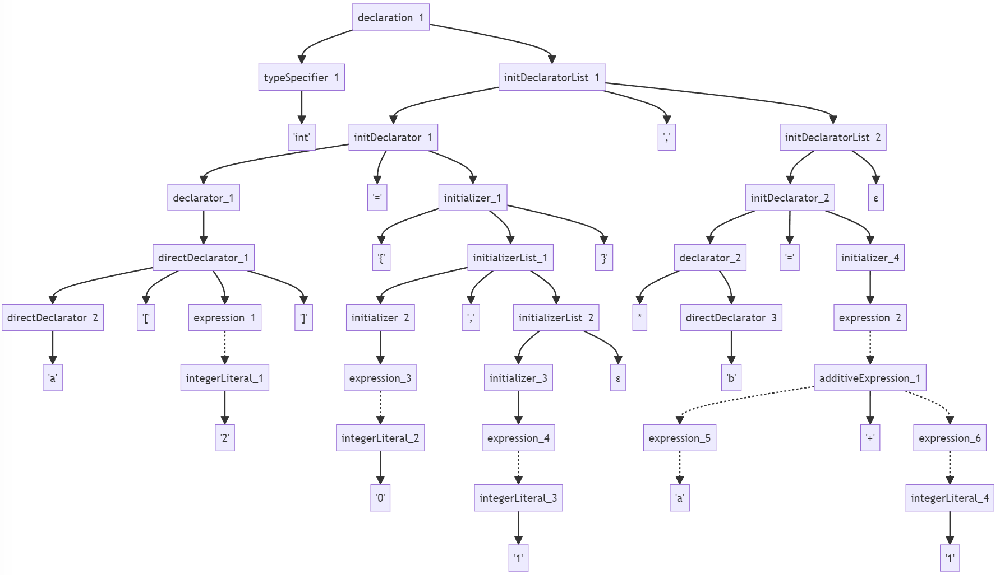
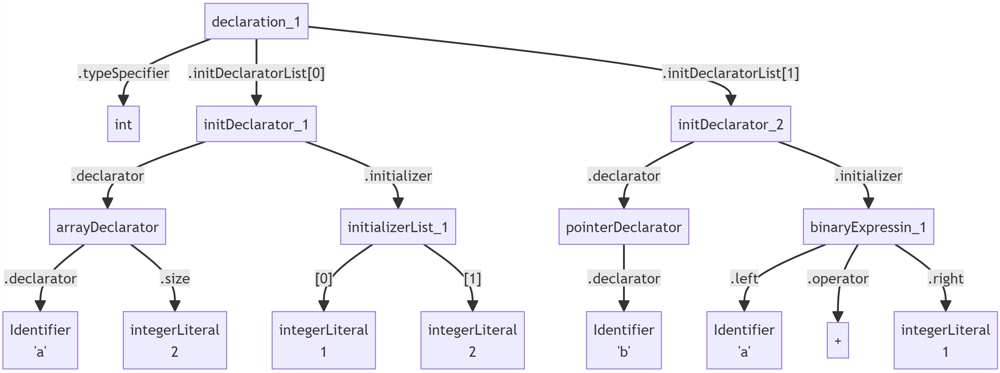
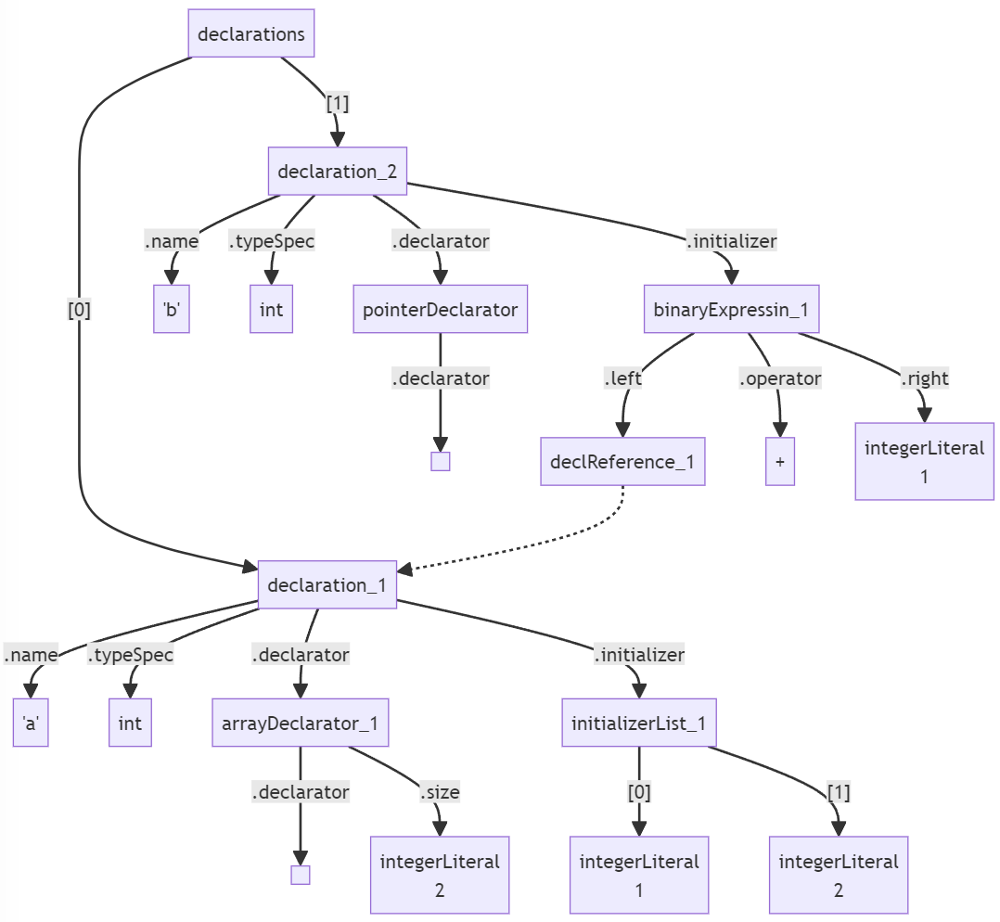
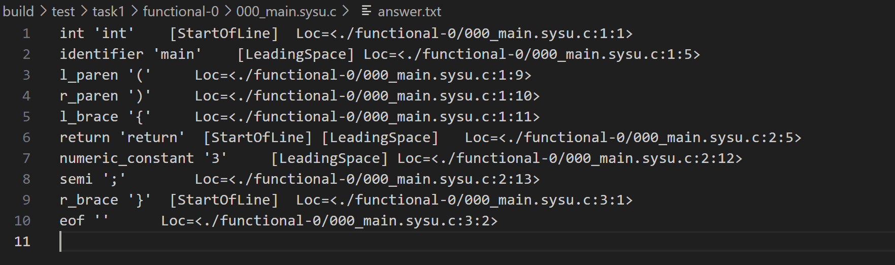
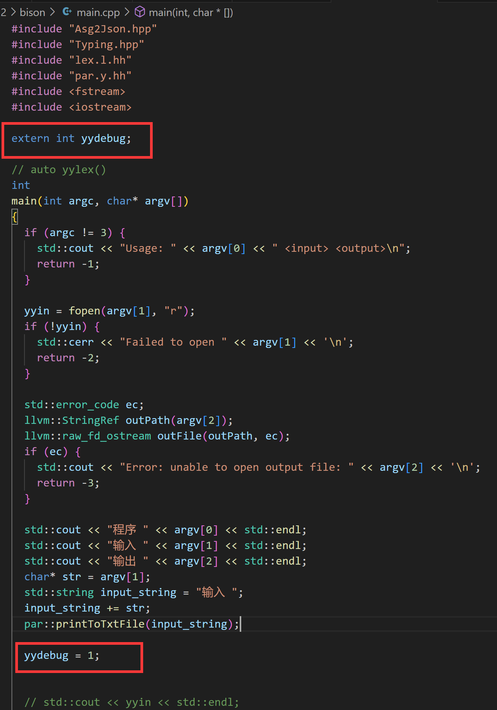
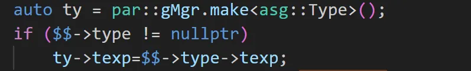
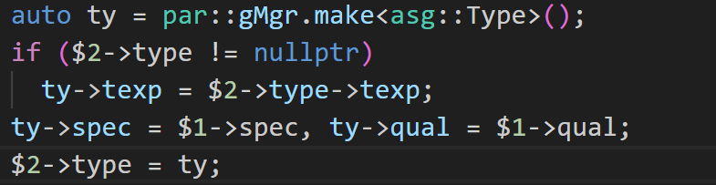

# 使用bison完成实验二

以复活版本的为例。

## 相关知识

### bison介绍

#### 基本介绍

打一个比喻，让大家对bison的功能有基本了解：

假如同学们在学习一种新的语言，这时候我们需要一个“词典”来翻译听到或者看到的这门语言的单词。同样，在计算机领域，编程语言也需要这样一个“词典”，我们称之为“解析器”，它用来读懂程序代码。

那么 Bison 就像是一个专门用来制作这种“词典”的工厂。你需要告诉Bison你的编程语言的规则，比如这门语言是怎样建立的，有哪些单词，单词之间又是怎样组合的等等，然后Bison就会根据你提供的这些规则，为你制作出一个符合这些规则的“词典”或者说“解析器”。

这个“解析器”可以作为一个针对特定编程语言的阅读工具，帮助计算机更好地理解这门语言的程序代码。比如说，当计算机通过这个“解析器”读到一个程序代码时，它可以告诉计算机这个代码的意思是让计算机执行什么样的操作。


通过上述的比喻，相信大家可以理解，bison 是一个语法分析器的生成器。而flex和bison常常进行配合使用，从而共同完成词法分析和语法分析。

大致可以将其处理流程理解如下（更为准确地在**bison实现原理**部分介绍）：

输入一个文件，flex可以对该文件进行正则表达式的匹配，从而生成一系列的token流（这个大家在实验一中已经很清楚了）。

而lex生成每一个token之后，将其传给bison进行处理：bison会对当前传入的token进行语法分析，即文法的匹配，并进行相应移进归约操作，从而完成语法分析。

同时，我们可以在bison进行移进归约操作的时候，进行自定义语义动作，从而可以完成语法分析。

bison的使用方式很简单，给出下列重要的知识总结：

#### Flex和bison的使用范式
Flex和Bison生成的代码分处于两个C源代码文件，它们各自单独编译，然后通过外部链接机制最终链接为一个整体。

Flex和Bison的代码文件在整体结构上都是被两个%%分成了三个部分：前言、主体、后记。

Flex和Bison默认用法的场景是传统的命令行指令式程序，生成使用全局变量的不可重入代码，并且Flex固定地从`<stdio.h>`输入输出数据。两者的关系以Bison为主，Flex只是辅助的可选项：Bison从代码文件生成一个`int yyparse()`;函数，其内部调用两个需要我们补充定义的函数`int yylex()`;、`void yyerror(const char *)`来读取词法单元流和报告错误，Flex就是用于生成那个`yylex`函数。

在联合使用时，我们应该首先编写Bison语法定义（`.y`），通过前言区的`%token`定义有哪几种词法单元，然后在Flex代码中包含生成的头文件，再编写词法单元的解析规则，这和我们实验1到实验2的顺序是相反的。知道这些之后，我们就得到了基本的文件骨架：
- `parser.y`
``` cpp
%code requires {
int yylex();
void yyerror(const char *);
}
%%
%%
```
为了让Bison生成的代码能够通过编译环节，必须在其中加入`yylex`和`yyerror`的声明。
- `lexer.l`
``` cpp
%{
#include "parser.tab.h"
%}
%%
%%
```
其中头文件名`"parser.tab.h"`是Bison的默认名字，你应该填你实际指定的文件名。这样生成的词法解析器代码默认会调用一个外部定义函数`yywrap`，如果你没定义就会导致链接通不过，对于本实验而言这个函数是没用的，因此实验1中的模板代码在前言区加入了一行`%option noyywrap`。
这里是一个最小的具体例子，用于解析正负数字：
- `parser.y`
``` cpp
%code top {
int yylex (void);
void yyerror (char const *);
}

%token NUMBER
%token ADD
%token SUB

%%
start: NUMBER | ADD NUMBER | SUB NUMBER;
%%
```
- `lexer.l`
``` cpp
%{
#include "parser.tab.h"
%}

%option noyywrap

%%
[0-9]+	{ return NUMBER; }
"+"		{ return ADD; }
"-"		{ return SUB; }
%%
```
联合使用就是上述的流程，如果同学们还是有点云里雾里。同学们可以找一些知乎CSDN等文章，下面这一篇是我找的，同学们可以上网搜更多的去看看：https://zhuanlan.zhihu.com/p/111445997 。 如果还是不懂， 欢迎咨询助教。

#### 使用`%union`和`$n`定义和访问语义值
同学们已经在理论课上了解到，每个语法解析树的结点都会和一些“属性”关联起来，不同结点有哪些属性一般都是不一样的，反映到代码里就是不同非终结符和终结符的语义值类型是不一样的，比如一个整数字面量可能对应一个`int`，而一个字符串字面量可能对应一个`char*`，所以总的而言文法符号的语义类型是这些类型的“或”，也就是一个联合类型，对应C中的联合体`union`。但是，使用联合体是十分容易出错的，Bison考虑到了这一点，所以它提供了`%union`和`$n`机制代替我们直接编写和操作联合体。

在前言区，使用`%union`定义所有可能的语义值类型，然后在`%nterm`和`%token`中将文法符号和类型关联起来：
```cpp
%union {
  int num;
  char* str;
}

%nterm <str> start
%token <num> NUMBER
%token <str> STRING
```
然后在主体部分直接使用`$n`就可以操作文法符号对应的语义值：
```cpp
start: NUMBER STRING { $$ = $2 + $1; } ;
```
其中`$$`、`$1`、`$2`会被Bison自动拓展为类似于`start.str`、`NUMBER.num`、`STRING.str`的联合体成员引用，并且Bison会帮我们检查类型的使用是否正确。语义值最终的来源是词法解析器，在`yylex`函数（flex主体部分）中，使用全局变量`yylval`填入词法单元的语义值，比如：
```cpp
[0-9]+ {
  yylval.num = atol(yytext);
  return NUMBER;
}

[a-zA-Z]+ {
  char* str = malloc(strlen(yytext));
  strcpy(str, yytext);
  yylval.str = str;
  return STRING;
}
```

#### bison实现原理（感兴趣了解）

首先要明白的一点是，Flex和Bison的代码不是C和C++源代码，严格地说它们是专用于生成词法解析器和语法解析器的领域特定语言（DSL）。bison不是语法分析器，只是用于生成语法分析器的一种语言。

使用bison定义了语义分析规则之后，其会生成`y.tab.h`, `y.tab.c`, `y.output`等文件，将这些文件与flex生成的文件`lex.yy.c`一起进行编译运行，最后可以得到一个可执行文件，而这个文件才是用作输入文本的语法分析器所用。

上述中间过程，我们都为同学们进行省略和遮盖，同学们以后如果需要自己用的话，这些中间过程必不可少。


#### bison官方文档（不建议看）
https://www.gnu.org/software/bison/manual/ 这是bison的官方文档，不建议看，在熟悉bison以后用于查找一些具体用法比较好。

#### bison总结

其实，在本实验中，需要理解bison的使用就是两个重要部分：文法书写和语义动作定义。

```cpp
start : translation_unit ; //这是文法的定义，表示start终结符可以推导为translation_unit终结符
```

在文法后面加入 `{}`，可以定义语义动作，语义动作是用Ｃ语言代码进行撰写，表示文法在进行规约的时候应该执行的代码。

```cpp
start
	: translation_unit //在最后进行加入，代表在规约的时候将执行{}中的代码。
		{
		par::gTranslationUnit.reset($1); 
		}　
	;
```

### ASG（抽象语义图）介绍

相比起AST（抽象语法树），在本实验中使用ASG（抽象语义图）更为恰当和合适（类似于AST，只是其的一种简化or变体，更能将其方便的json的转化和输出）。


#### 语法解析树、抽象语法树、抽象语义图的对比
在学习了这么多编译原理的课程知识后，相信同学们已经了解了“语法解析树”和“抽象语法树”的概念，这里我们把它们进行对比一下，使用的例子是一个很短的全局变量声明：`int a[2] = {0, 1}, *b = a + 1;`。
- **语法解析树（Parse Tree）**
语法解析树包含语法解析过程中的所有非终结符号和终结符号，一个递归下降语法分析器的运行过程可以视为是对语法解析树的深度优先遍历。语法解析树通常是非常复杂和庞大的，因此一般并不会真的生成出来，例如上面的例子如果真的生成一个语法解析树，那他可能是这个样子：

希望这张图能够让你感受到语法解析树的复杂和庞大。而实际上，上图其实已经简化了表达式相关语法规则（虚线表示），后面为我们会看到，因为运算符优先级的存在，每个表达式结点实际上都会产生出一个长长的分支链。

- **抽象语法树（Abstract Syntax Tree）**
抽象语法树通过去掉了那些只起到结构标识作用的结点、压缩树的层级等方式大大简化了语法解析树的结构。上面的例子对应的抽象语法树可能是：

很显然AST比语法解析树简单得多，ANTLR、Boost.Spirit等此类的语法解析器框架的输出结果往往都是这种形式。

- **抽象语义图（Abstract Semantic Graph）**
单论名字的用法而言，大家并不是那么严格地区分“ASG”和“AST”，很多人把他的IR数据结构称为AST，尽管这些数据结构的引用关系在事实上是图而并非树。不过，相比于那些语法解析器框架，我们上面定义的C++结构体们与之还是有很大差别的，这主要体现在语义结点的相互引用上：

相比于AST中存储的是变量名，我们在`declReference_1`中直接存储指向变量声明的那个语义结点指针，这将会给后面的分析和变换的代码编写带来极大的便利。

#### ASG总结
其实能够理解到ASG就是一种可以储存代码中的各个不同结构（比如，表达式，句子，声明）的一堆结构体就可以了。

我们使用ASG结构并不是必须的，只是为了在中间进行储存这些文法结构，从而方便地进行之后的json打印，这只是一种代码设计的方案。

### 文法参考1
本实验采用的文法是SysY语言（编译器比赛中所定义的语言用的文法），其文法如下。

目前提供的代码中的文法可能与下述给出的有细微不相同，但是表达的是一个意思，这无伤大雅，同学们可以作参考。
<details>
  <summary>
    完整文法
  </summary>
  
``` cpp
start         ::= CompUnit; // start为开始符号
CompUnit      ::= [CompUnit] (Decl | FuncDef);

Decl          ::= ConstDecl | VarDecl;
ConstDecl     ::= "const" BType ConstDef {"," ConstDef} ";";
BType         ::= "int" | "char" | "long long";
ConstDef      ::= IDENT {"[" ConstExp "]"} "=" ConstInitVal;
ConstInitVal  ::= ConstExp | "{" [ConstInitVal {"," ConstInitVal}] "}";
VarDecl       ::= BType VarDef {"," VarDef} ";";
VarDef        ::= IDENT {"[" ConstExp "]"}
                | IDENT {"[" ConstExp "]"} "=" InitVal;
InitVal       ::= Exp | "{" [InitVal {"," InitVal}] "}";

FuncDef       ::= FuncType IDENT "(" [FuncFParams] ")" Block;
FuncType      ::= "void" | "int";
FuncFParams   ::= FuncFParam {"," FuncFParam};
FuncFParam    ::= BType IDENT ["[" "]" {"[" ConstExp "]"}];

Block         ::= "{" {BlockItem} "}";
BlockItem     ::= Decl | Stmt;
Stmt          ::= LVal "=" Exp ";"
                | [Exp] ";"
                | Block
                | "if" "(" Exp ")" Stmt ["else" Stmt]
                | "while" "(" Exp ")" Stmt
                | "break" ";"
                | "continue" ";"
                | "return" [Exp] ";";
                | "do" "{" Stmt "}" "while" "(" Stmt ")" ";"

Exp           ::= LOrExp;
LVal          ::= IDENT {"[" Exp "]"};
PrimaryExp    ::= "(" Exp ")" | LVal | Number;
Number        ::= INT_CONST;
UnaryExp      ::= PrimaryExp | IDENT "(" [FuncRParams] ")" | UnaryOp UnaryExp;
UnaryOp       ::= "+" | "-" | "!";
FuncRParams   ::= Exp {"," Exp};
MulExp        ::= UnaryExp | MulExp ("*" | "/" | "%") UnaryExp;
AddExp        ::= MulExp | AddExp ("+" | "-") MulExp;
RelExp        ::= AddExp | RelExp ("<" | ">" | "<=" | ">=") AddExp;
EqExp         ::= RelExp | EqExp ("==" | "!=") RelExp;
LAndExp       ::= EqExp | LAndExp "&&" EqExp;
LOrExp        ::= LAndExp | LOrExp "||" LAndExp;
ConstExp      ::= Exp;
```
</details>

如果需要SysY语言更为详细的文法解释和定义，可以参考该链接：https://gitlab.eduxiji.net/nscscc/compiler2021/-/blob/master/SysY%E8%AF%AD%E8%A8%80%E5%AE%9A%E4%B9%89.pdf

### 文法参考2
本实验模板代码所取用的文法如下，不过下述文法是非常完整的类C语言的文法，同学们可以取用自己需要的即可。
<details>
  <summary>
    完整文法
  </summary>

  ``` yacc
start
	: translation_unit { par::gTranslationUnit.reset($1); }
	;

primary_expression
	: IDENTIFIER
	| CONSTANT
	| STRING_LITERAL
	| '(' expression ')'
	;

postfix_expression
	: primary_expression
	| postfix_expression '[' expression ']'
	| postfix_expression '(' ')'
	| postfix_expression '(' argument_expression_list ')'
	| postfix_expression '.' IDENTIFIER
	| postfix_expression PTR_OP IDENTIFIER
	| postfix_expression INC_OP
	| postfix_expression DEC_OP
	| '(' type_name ')' '{' initializer_list '}'
	| '(' type_name ')' '{' initializer_list ',' '}'
	;

argument_expression_list
	: assignment_expression
	| argument_expression_list ',' assignment_expression
	;

unary_expression
	: postfix_expression
	| INC_OP unary_expression
	| DEC_OP unary_expression
	| unary_operator cast_expression
	| SIZEOF unary_expression
	| SIZEOF '(' type_name ')'
	;

unary_operator
	: '&'
	| '*'
	| '+'
	| '-'
	| '~'
	| '!'
	;

cast_expression
	: unary_expression
	| '(' type_name ')' cast_expression
	;

multiplicative_expression
	: cast_expression
	| multiplicative_expression '*' cast_expression
	| multiplicative_expression '/' cast_expression
	| multiplicative_expression '%' cast_expression
	;

additive_expression
	: multiplicative_expression
	| additive_expression '+' multiplicative_expression
	| additive_expression '-' multiplicative_expression
	;

shift_expression
	: additive_expression
	| shift_expression LEFT_OP additive_expression
	| shift_expression RIGHT_OP additive_expression
	;

relational_expression
	: shift_expression
	| relational_expression '<' shift_expression
	| relational_expression '>' shift_expression
	| relational_expression LE_OP shift_expression
	| relational_expression GE_OP shift_expression
	;

equality_expression
	: relational_expression
	| equality_expression EQ_OP relational_expression
	| equality_expression NE_OP relational_expression
	;

and_expression
	: equality_expression
	| and_expression '&' equality_expression
	;

exclusive_or_expression
	: and_expression
	| exclusive_or_expression '^' and_expression
	;

inclusive_or_expression
	: exclusive_or_expression
	| inclusive_or_expression '|' exclusive_or_expression
	;

logical_and_expression
	: inclusive_or_expression
	| logical_and_expression AND_OP inclusive_or_expression
	;

logical_or_expression
	: logical_and_expression
	| logical_or_expression OR_OP logical_and_expression
	;

conditional_expression
	: logical_or_expression
	| logical_or_expression '?' expression ':' conditional_expression
	;

assignment_expression
	: conditional_expression
	| unary_expression assignment_operator assignment_expression
	;

assignment_operator
	: '='
	| MUL_ASSIGN
	| DIV_ASSIGN
	| MOD_ASSIGN
	| ADD_ASSIGN
	| SUB_ASSIGN
	| LEFT_ASSIGN
	| RIGHT_ASSIGN
	| AND_ASSIGN
	| XOR_ASSIGN
	| OR_ASSIGN
	;

expression
	: assignment_expression
	| expression ',' assignment_expression
	;

constant_expression
	: conditional_expression
	;

declaration
	: declaration_specifiers ';'
	| declaration_specifiers init_declarator_list ';'
	;

declaration_specifiers
	: storage_class_specifier
	| storage_class_specifier declaration_specifiers
	| type_specifier
	| type_specifier declaration_specifiers
	| type_qualifier
	| type_qualifier declaration_specifiers
	| function_specifier
	| function_specifier declaration_specifiers
	;

init_declarator_list
	: init_declarator
	| init_declarator_list ',' init_declarator
	;

init_declarator
	: declarator
	| declarator '=' initializer
	;

storage_class_specifier
	: TYPEDEF
	| EXTERN
	| STATIC
	| AUTO
	| REGISTER
	;

type_specifier
	: VOID
	| CHAR
	| SHORT
	| INT
	| LONG
	| FLOAT
	| DOUBLE
	| SIGNED
	| UNSIGNED
	| BOOL
	| COMPLEX
	| IMAGINARY
	| struct_or_union_specifier
	| enum_specifier
	| TYPE_NAME
	;

struct_or_union_specifier
	: struct_or_union IDENTIFIER '{' struct_declaration_list '}'
	| struct_or_union '{' struct_declaration_list '}'
	| struct_or_union IDENTIFIER
	;

struct_or_union
	: STRUCT
	| UNION
	;

struct_declaration_list
	: struct_declaration
	| struct_declaration_list struct_declaration
	;

struct_declaration
	: specifier_qualifier_list struct_declarator_list ';'
	;

specifier_qualifier_list
	: type_specifier specifier_qualifier_list
	| type_specifier
	| type_qualifier specifier_qualifier_list
	| type_qualifier
	;

struct_declarator_list
	: struct_declarator
	| struct_declarator_list ',' struct_declarator
	;

struct_declarator
	: declarator
	| ':' constant_expression
	| declarator ':' constant_expression
	;

enum_specifier
	: ENUM '{' enumerator_list '}'
	| ENUM IDENTIFIER '{' enumerator_list '}'
	| ENUM '{' enumerator_list ',' '}'
	| ENUM IDENTIFIER '{' enumerator_list ',' '}'
	| ENUM IDENTIFIER
	;

enumerator_list
	: enumerator
	| enumerator_list ',' enumerator
	;

enumerator
	: IDENTIFIER
	| IDENTIFIER '=' constant_expression
	;

type_qualifier
	: CONST
	| RESTRICT
	| VOLATILE
	;

function_specifier
	: INLINE
	;

declarator
	: pointer direct_declarator
	| direct_declarator
	;

direct_declarator
	: IDENTIFIER
	| '(' declarator ')'
	| direct_declarator '[' type_qualifier_list assignment_expression ']'
	| direct_declarator '[' type_qualifier_list ']'
	| direct_declarator '[' assignment_expression ']'
	| direct_declarator '[' STATIC type_qualifier_list assignment_expression ']'
	| direct_declarator '[' type_qualifier_list STATIC assignment_expression ']'
	| direct_declarator '[' type_qualifier_list '*' ']'
	| direct_declarator '[' '*' ']'
	| direct_declarator '[' ']'
	| direct_declarator '(' parameter_type_list ')'
	| direct_declarator '(' identifier_list ')'
	| direct_declarator '(' ')'
	;

pointer
	: '*'
	| '*' type_qualifier_list
	| '*' pointer
	| '*' type_qualifier_list pointer
	;

type_qualifier_list
	: type_qualifier
	| type_qualifier_list type_qualifier
	;

parameter_type_list
	: parameter_list
	| parameter_list ',' ELLIPSIS
	;

parameter_list
	: parameter_declaration
	| parameter_list ',' parameter_declaration
	;

parameter_declaration
	: declaration_specifiers declarator
	| declaration_specifiers abstract_declarator
	| declaration_specifiers
	;

identifier_list
	: IDENTIFIER
	| identifier_list ',' IDENTIFIER
	;

type_name
	: specifier_qualifier_list
	| specifier_qualifier_list abstract_declarator
	;

abstract_declarator
	: pointer
	| direct_abstract_declarator
	| pointer direct_abstract_declarator
	;

direct_abstract_declarator
	: '(' abstract_declarator ')'
	| '[' ']'
	| '[' assignment_expression ']'
	| direct_abstract_declarator '[' ']'
	| direct_abstract_declarator '[' assignment_expression ']'
	| '[' '*' ']'
	| direct_abstract_declarator '[' '*' ']'
	| '(' ')'
	| '(' parameter_type_list ')'
	| direct_abstract_declarator '(' ')'
	| direct_abstract_declarator '(' parameter_type_list ')'
	;

initializer
	: assignment_expression
	| '{' initializer_list '}'
	| '{' initializer_list ',' '}'
	;

initializer_list
	: initializer
	| designation initializer
	| initializer_list ',' initializer
	| initializer_list ',' designation initializer
	;

designation
	: designator_list '='
	;

designator_list
	: designator
	| designator_list designator
	;

designator
	: '[' constant_expression ']'
	| '.' IDENTIFIER
	;

statement
	: labeled_statement
	| compound_statement
	| expression_statement
	| selection_statement
	| iteration_statement
	| jump_statement
	;

labeled_statement
	: IDENTIFIER ':' statement
	| CASE constant_expression ':' statement
	| DEFAULT ':' statement
	;

compound_statement
	: '{' '}'
	| '{' block_item_list '}'
	;

block_item_list
	: block_item
	| block_item_list block_item
	;

block_item
	: declaration
	| statement
	;

expression_statement
	: ';'
	| expression ';'
	;

selection_statement
	: IF '(' expression ')' statement
	| IF '(' expression ')' statement ELSE statement
	| SWITCH '(' expression ')' statement
	;

iteration_statement
	: WHILE '(' expression ')' statement
	| DO statement WHILE '(' expression ')' ';'
	| FOR '(' expression_statement expression_statement ')' statement
	| FOR '(' expression_statement expression_statement expression ')' statement
	| FOR '(' declaration expression_statement ')' statement
	| FOR '(' declaration expression_statement expression ')' statement
	;

jump_statement
	: GOTO IDENTIFIER ';'
	| CONTINUE ';'
	| BREAK ';'
	| RETURN ';'
	| RETURN expression ';'
	;

translation_unit
	: external_declaration
	| translation_unit external_declaration
	;

external_declaration
	: function_definition
	| declaration
	;

function_definition
	: declaration_specifiers declarator declaration_list compound_statement
	| declaration_specifiers declarator compound_statement
	;

declaration_list
	: declaration
	| declaration_list declaration
	;
```
</details>


## 总体思路(main.cpp)

以main.cpp为入口，实验2首先进行语法分析：`yyparse`（在其中进行填充ASG的结构），然后进行类型检查 `typing(*par::gTranslationUnit)`，最后将asg生成json文件 `asg2json`，并且写入指定文件。

在语法分析中，bison的 `yyparse`中有下面的逻辑：

- 由于实验2以复活版本的进行实验，因此输入的是task1-answer，同学们可以看下其中的一个文件：`/workspaces/SYsU-lang2/build/test/task1/functional-0/000_main.sysu.c/answer.txt`，如下图所示



- `bison`会读取词法分析`lex`中的传入的`token`（`lex`每读取一个，就会传给`bison`进行语法分析），因此将上述文件输入到实验2中，此时词法分析`lex`相关部分代码比起实验一会发生变化，不过这一部分的代码目前已经写好了，同学们可以自行查看。
  （其逻辑是：相比于实验一的输入直接是源文件从而进行相关的各个`token`的匹配，实验二复活版本将匹配上述输入文件的每一行，然后对每一行进行处理，提取出每行的第一个单词（`tokenId`）和每行的第二个单词中的引号内容（`tokenValue`）。例如，以一行为例，识别出的`token`：其`tokenId`为`int`，其`tokenValue`为引号内的内容，也为`int`。）
- `bison`拿到该`token`后，首先进行文法的匹配，进行移进归约操作，而后在每个移进归约的过程中完成用户自定义的语义动作，在本实验中，我们是生成并填充ASG结构。

在类型检查中，`typing`则将对生成的ASG中的每一个结构进行类型检查，如果不通过该类型检查，程序就会停止。同学可以利用这个方便地进行查错，判断自己到底是哪个类型没有写对。

在ASG生成json文件中，`asg2json`将在yyparse中生成并通过类型检查的ASG结构进行输出并打印。

而类型检查和ASG生成json文件的部分，已经进行了基本的实现，同学们只要负责**语法分析中的文法撰写和语义动作撰写**即可，即，`par.y`文件的补充。（如果想要拿到评分标准的第三档，可能需要自行在ASG中添加结构，并在asg2json部分进行打印，不过当同学们完成评分标准的前两档，已经对ASG和asg2json有全面的了解，因此是不太难的事情。如有任何困难，欢迎问助教。）

## 文件结构说明

对实验整体的整体过程有了把握，我们接下来看下这部分实验文件的整体结构。

```bash
-- bison
   |-- lex.cpp
   |-- lex.hpp
   |-- lex.l
   |-- main.cpp
   |-- par.cpp
   |-- par.hpp
   |-- par.y
-- common
   |-- Asg2Json.cpp
   |-- Asg2Json.hpp 
   |-- Typing.cpp
   |-- Typing.hpp
   |-- asg.hpp
```

其中 `common`是共有文件，包含了：ASG结构定义文件 `asg.hpp`，类型检查需要用到的文件:`Typing.hpp`和 `Typing.cpp`，ASG转换为Json的文件：`Asg2Json.hpp`和 `Asg2Json.cpp`。

其具体解析见公共代码介绍。

其中 `bison`是本实验的部分，包含了：

- `main.cpp` 程序入口，详细解析见上述总体思路。
- 词法分析相关文件：复活版本（即从标准答案task1-answer中进行读取），包含了：`lex.l`，`lex.hpp`和 `lex.cpp`文件。其中 `lex.l`是用于写词法分析的规则部分，`.hpp`和 `.cpp`文件是用于定义相关辅助函数的文件。
- 语法分析相关文件：包含了：`par.y`，`par.hpp`和 `par.cpp`文件。其中其中 `par.y`是用于写语法分析相关的文法以及语义动作，`.hpp`和 `.cpp`文件是用于定义相关辅助函数的文件。

## 代码说明和解析

这个部分将会对重点代码进行说明和解析，同时，将会以一个文法为小例子进行讲解，方便同学们理解。

### 以一个简单的文法为例子说明
举一个例子，语句的文法其中一种表示如下：
```bash
statement -> compound_statement
	| expression_statement（表达式语句）
	| selection_statement（选择语句）
	| iteration_statement（迭代语句）
	| jump_statement ; （跳转语句）
```   
其中选择语句的文法的其中一种表示如下：
```bash
selection_statement -> IF '(' expression ')' statement
| IF '(' expression ')' statement ELSE statement;
```
**文法撰写：**

则在`par.y`文件中添加的代码应该如下表示。这个文法代码的添加非常简单，只需要按照`bison`的语法把`->`变为`:`即可。

```cpp
// 只是部分文法，并不是全面的
statement
   : compound_statement
   | expression_statement
   | jump_statement
;
jump_statement
   : RETURN ';' 
   | RETURN expression ';'
;
```
**语义动作撰写：**
从语法分析树直接转化到JSON的输出是十分困难的，我们需要进行一些封装和转换，从而可以简便地通过`bison`的语义动作进行填充定义的ASG结构，从而为之后的json转化做铺垫。

由刚刚的例子，我们在`asg.hpp`中语句找到对应的结构（对于一些结构体的含义不太清楚的，可以通过`asg2json.cpp`中的每个结构的打印方式即可知道该结构体对应的是什么，建议同学们都看看`asg2json.cpp`这样对结构体的含义更为清晰，也以免出错。）
```cpp
struct Stmt : public Obj // 语句
{};

struct CompoundStmt : public Stmt // 复合语句
{
std::vector<Stmt*> subs;
};

struct ReturnStmt : public Stmt // Return语句
{
  FunctionDecl* func{ nullptr };
  Expr* expr{ nullptr };
};
```
则想要对刚刚文法生成相应的ASG结构则要进行填充，则在刚刚bison的文法代码上加上语义动作如下。即匹配到了相应的文法之后，所进行的代码动作。
```cpp
statement // Stmt
  : compound_statement 
    { 
      $$ = $1; 
    }
  | expression_statement 
    { 
      $$ = $1; 
    }
  | jump_statement 
    { 
      $$ = $1; 
    }
  ;
jump_statement // ReturnStmt
  : RETURN ';' 
    {
      auto p = &par::gMgr.make<asg::ReturnStmt>();
      $$ = p;
    }
  | RETURN expression ';'  
    {
      auto p = &par::gMgr.make<asg::ReturnStmt>();
      p->expr = $2;
      $$ = p;
    }
  ;
```
解释`statement`的语义动作：
- `$$ = $1;` 直接将`statement`的值令为文法左边第一个符号的值。

解释`selection_statement`的语义动作：
- 使用`&par::gMgr.make<asg::ReturnStmt>();`进行构造`ReturnStmt`结构体。具体可以看`make`的代码，只要是直接或间接继承于`Obj`类型的都可以用这个构造器进行构造。
然后填充该结构体，根据asg的定义，需要填充`func`、`expr`结构，在这里只能填充`expr`结构。
- 显然`$2`（文法右边第二个表示为`expression`，用`$`进行取出）为该语句的`expression`，因此有`p->expr = $2;`
- `$$ = p;` `$$`为文法右边的值即`jump_statement`的值，则此动作为将该`jump_statement`的值设置为`ReturnStmt`的值。


记得`par.y`相对应的地方进行类型的定义。以`compound_statement`为例。

```cpp
%union {
   asg::CompoundStmt* CompoundStmt;  // 首先进行类型的命名
}

%nterm <CompoundStmt> compound_statement // 然后即可再此使用
```

其实最后所有文法的语义动作总的生成的就是一个`TranslationUnit`的结构体，其中包含了所有的ASG的信息，可以查看下面的代码。最后`asg2json`就是抓住这个节点以其为根，然后进行遍历其中进行打印出相应所有的节点。
```cpp
start
   : translation_unit 
      {
      par::gTranslationUnit.reset($1); 
      }
   ;
```
## 如何debug

### yydebug
yyparse部分出现问题，即bison的文法规约等出现问题，直接设置yydebug为1即可。在main.cpp中加入以下的代码。

即可打印出详细的bison文法移进规约栈的信息，从而进行定位。

需要提醒的是，这部分是不适合不适合使用断点进行调试的，因为其会跳到bison生成的代码进行状态的不断跳转，根本不知道文法到底归约到哪里了。

文法的移进规约直接使用yydebug，而其语义动作的定位再配合`std::cout`打印即可。

### 断点调试
在`Typing`和`Asg2Json`部分使用使用断点调试，看下是哪一部分生成不到位出了问题。配合`std::cout`打印更佳。

### 输出到文件
有时候编译很顺畅的进行通过的时候，`std::cout`是打印不出的，因此这个时候可以将`std::cout`写入到文件里面。例如可以定义以下函数，然后使用该函数就可以打印到指定文件，即可进行debug。
```cpp
void printToTxtFile(std::string message) {
    std::ofstream myfile;
    myfile.open ("/workspaces/SYsU-lang/task/2/bison/log.txt", std::ios_base::app); // 'app' means appending to the end of the file, trunc: start of the file
    myfile << message << "\n";
    myfile.close();
}
```

## 可能会遇到的坑点

- 指针问题
取type的时候，其指针可能是空的，如果这个时候再取其texp对象，就会终止，也不会有报错信息，最好判断一下是不是空指针再去取。
比如，如下图所示。


- 更改ASG的`Type`类型
更改ASG的`Type`类型，只能改变指针指向，不能直接去赋值。
比如，如下图所示。新建一个`ty`的`Type`对象，更改`ty`，然后改变`$2`的`type`指针的指向为更改后的`ty`。如果直接进行`$2->type->spec=...`是不运行的，因为ASG结构体的`Type`为`const Type *`类型。
