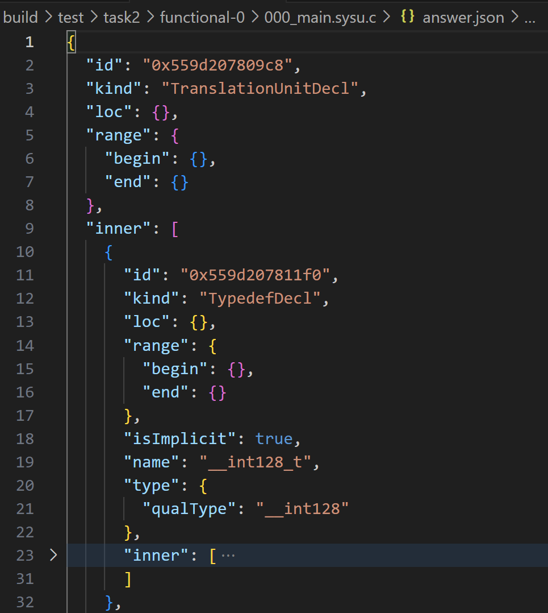
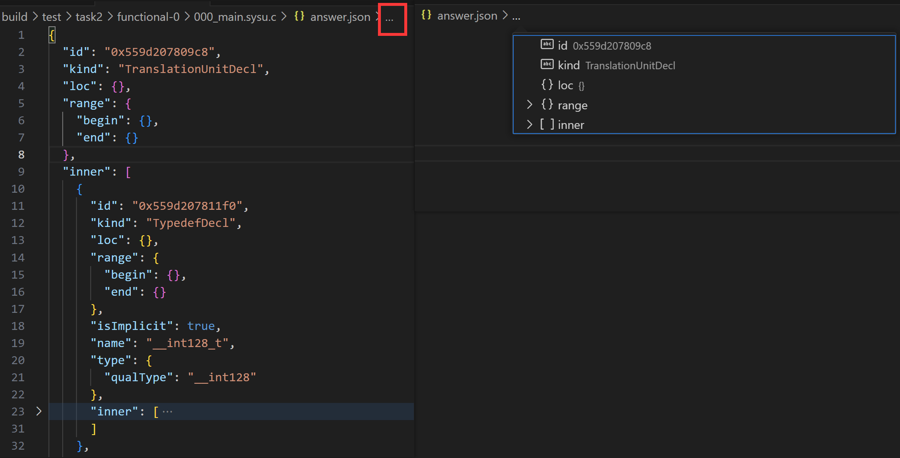
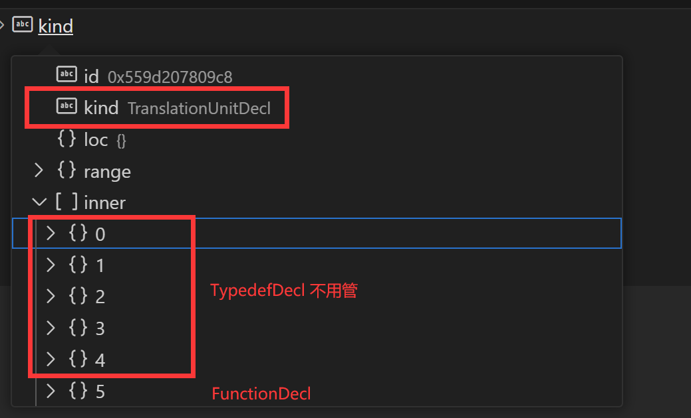

## 任务描述

在本次实验中，我们首先需要完成一个语法分析器。实验一中我们实现了一个词法分析器，源代码文件输入词法分析器后将会生成 token 流，token 流输入到语法分析器之后会生成语法分析树 AST。AST 主要反映了程序的结构，但不足以全面表示程序的语义信息。语法分析图 ASG 在 AST 的基础上增加了额外的语义信息，如作用域、类型信息、变量和函数之间的关系等，这有助于进一步的编译优化、类型检查和代码生成等步骤。但是在本次实验中不管是 AST 还是 ASG，都是位于内存中的数据结构，不便于同学们进行打印输出或者代码调试以及实验评分，所以最终我们还需要实现 ASG 数据结构到 JSON 格式输出的实现。

以`000_main.sysu.c`这个最简单的测试样例为例，最终由`clang parse`生成的json文件标准答可以在`/workspaces/SYsU-lang2/build/test/task2/functional-0/000_main.sysu.c/answer.json`文件处查看，



下面对这个文件进行一些说明：

首先是对引号内的关键词进行解释,

- id: 唯一标识符，用于区分AST中的每一个节点。
- kind: 节点类型，表示该节点代表的源代码结构的种类，如TypedefDecl（类型定义声明）、BuiltinType（内置类型）、FunctionDecl（函数声明）等。
- loc: 位置信息，通常包含文件名、行号和列号，用于指示源代码中该元素的位置。在此例中，位置信息似乎被省略了。
- range: 范围信息，指出了源代码中该节点覆盖的起始和结束位置。它有begin和end两个属性，每个属性可能包含偏移量、行号、列号等信息，用于准确定位代码片段。
- inner: 内部节点，这个列表包含了当前节点下的子节点。例如，一个FunctionDecl节点会包含它的参数和函数体等子节点。
- isImplicit: 表示该声明是否是隐式的，即没有在源代码中直接写出来，而是由编译器自动生成的。
- name: 节点名称，比如类型名称、函数名称等。
- type: 节点类型，包含了类型信息，如__int128、unsigned __int128等。对于类型节点，qualType属性描述了类型的完整限定名。
- decl: 声明信息，某些节点（如RecordType）可能包含对声明本身的引用。
- size: 大小，主要用于数组类型，表示数组的元素数量。
- valueCategory: 值类别，如prvalue，表示纯右值。
- value: 节点值，对于字面量如整数字面量，这个字段包含了具体的值。


此外，通过`vscode`可以很方便地看到其结构，我们采取下述方式:鼠标点击以下图示红框部分就会显示这个文件的结构，



以这个文件为例，其最外层的结构的`kind`（种类）为`TranslationUnitDecl`，然后其有个属性为`inner`，包含其余6个部分（0-5）：前5个都是`TypedefDecl`，最后一个是`FunctionDecl`，将其进行展开继续查看。



由该文件，可以得到其整体结构为：
```bash
|-- TranslationUnitDecl
   |-- 多个TypedefDecl
   |-- FunctionDecl
      |-- CompoundStmt
         |-- ReturnStmt
            |-- IntegerLiteral
```


### 评分标准
同学们查看json文件，会发现上述每个节点里面包含了非常多的属性，除去TypedefDecl不用管之外，我们的评分以属性打印为准，具体如下：
- 是否提取出正确的 "kind"、"name"、"value" 键值，不含 "InitListExpr"（60 分）
- 是否提取出正确的 "type" 键值及是否构造正确的 "InitListExpr" 生成树（40 分）。