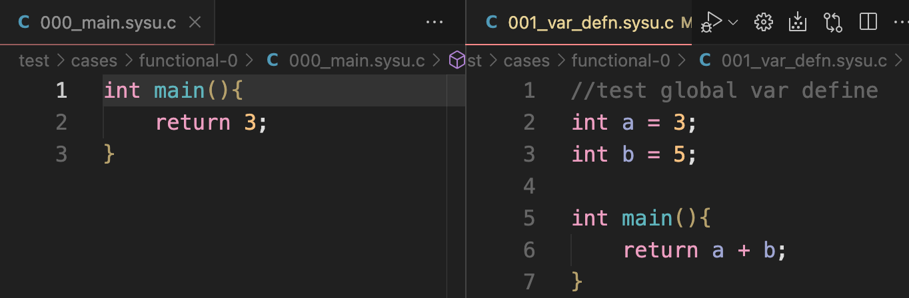
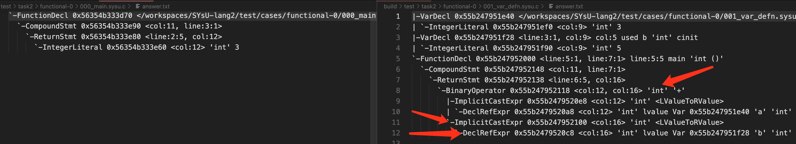
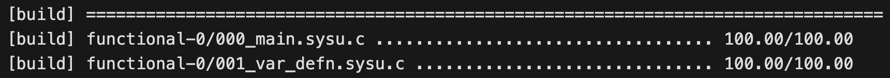

# 实验三上手教程
注意，请同学们阅读本小节之前先阅读`实验介绍`以及`Emit IR 介绍`。

本次实验中需要同学们修改的代码只有`EmitIR.cpp`和`EmitIR.hpp`。和实验二中一样，对于某一种语法结构，我们可能需要添加一个处理函数，其中这个函数的主体我们需要在`EmitIR.cpp`中编写，同时将其申明写到`EmitIR.hpp`中。

接下来以实验中的测试样例二为例，带领同学们了解这整个流程。首先通过比对测例1和测例2的源代码，



以及实验二中测例1和测例2的 `answer.txt`的输出



我们可以发现实际上测例2比测例1多了几种语法结构需要我们进行处理，它们分别是

- 变量声明  VarDecl （int a = 3）
- 声明引用表达式  DeclRefExpr (a + b表达式中的 a 和  b)
- 加法表达式  (a+b)
- 隐式类型转换 (在加法运算前将左值转换为右值)


首先我们需要在对申明进行处理的`operator()`重载函数中加入对变量申明的跳转。

```c++
void
EmitIR::operator()(Decl* obj)
{
  // TODO: 添加变量声明处理的跳转
  if (auto p = obj->dcst<VarDecl>())
    return self(p);

  if (auto p = obj->dcst<FunctionDecl>())
    return self(p);

  ABORT();
}
```
在上述的`operator()`重载函数中添加了对变量声明的处理跳转之后，我们需要在`EmitIR.cpp`中实现处理变量声明的`operator()`重载函数，并在`EmitIR.hpp`中声明它。需要同学们注意的是，第二个测试样例不仅存在变量的申明，并且还存在变量的值初始化，为了使得我们的实现更加清晰简洁，我们将变量的声明和初始化分开进行实现。

此时请同学们跳转到我们实验 3 文档下面的`生成 LLVM IR`，然后找到`全局变量`下面的`创建全局变量`中的内容，在其中同学们可以找到和全局变量相关的我们需要使用到的`api`

```c++
#include <llvm/IR/GlobalVariable.h>

/// M：            llvm::Module实例，包含所有 LLVM IR 的顶层容器
///                  全局变量创建完成后将会自动插入 M 的符号表中
/// Ty：            全局变量的类型
/// isConstant：    是否是常量
/// Linkage：    全局变量的链接类型，如是否被外部函数可见
/// Initializer：初始值
/// Name：        全局变量的名字
/// 其他参数在本次实验中可以不用关注
GlobalVariable(Module &M, Type *Ty, 
               bool isConstant, LinkageTypes Linkage, 
               Constant *Initializer, const Twine &Name="", 
               GlobalVariable *InsertBefore=nullptr, 
               ThreadLocalMode=NotThreadLocal, 
               std::optional< unsigned > AddressSpace=std::nullopt, 
               bool isExternallyInitialized=false);
```
以及
```c++
/// 举个简单的例子，例如：int a = 10

/// 1. 创建全局变量，并为全局变量暂时先指定零初始化
llvm::Type *ty = llvm::Type::getInt32Ty(TheContext);
llvm::GlobalVariable *gloVar =
    new llvm::GlobalVariable(TheModule, ty, false, /* Not constant */
                             llvm::GlobalValue::ExternalLinkage,
                             nullptr /* 初始值为 nullptr */, "glolVar");
/// 零初始化
gloVar->setInitializer(llvm::Constant::getNullValue(ty));

/// 2. 创建函数，完成为全局变量进行初始化的逻辑
/// 函数返回值为 void，无参数
/// 函数名字为 ctor
llvm::Function *ctorFunc = llvm::Function::Create(
    llvm::FunctionType::get(llvm::Type::getVoidTy(TheContext), false),
    llvm::GlobalValue::PrivateLinkage, "ctor", &TheModule);
/// 为函数 ctorFunc 创建 entry 基本块
llvm::BasicBlock *entryBlock = llvm::BasicBlock::Create(TheContext, "entry", ctorFunc);
/// 设置 LLVM IR 插入点为 entry 基本块
TheBuilder.SetInsertPoint(entryBlock);
/// 创建 store 指令将常量1存入全局变量 gloVar
TheBuilder.CreateStore(llvm::ConstantInt::get(llvm::Type::getInt32Ty(TheContext), 10), gloVar);

/// 3. 将函数添加至模块 TheModule 的全局构造函数数组中,65535为优先级
///    优先级数值越大执行时间越靠后，优先级数值最大值为65535
///    模块被加载时，全局构造函数数组中的全局构造函数将按照优先级依次执行
llvm::appendToGlobalCtors(TheModule, ctorFunc, 65535);

```
所以最终我们写出的处理全局变量申明以及初始化的两个函数如下
```c++
void
EmitIR::trans_init(llvm::Value* val, Expr* obj)
{
  auto& irb = *mCurIrb;

  // 仅处理整数字面量的初始化
  if (auto p = obj->dcst<IntegerLiteral>()) {
    auto initVal = llvm::ConstantInt::get(self(p->type), p->val);
    irb.CreateStore(initVal, val);
    return;
  }

  // 如果表达式不是整数字面量，则中断编译
  ABORT();
}

void
EmitIR::operator()(VarDecl* obj)
{

  auto ty = llvm::Type::getInt32Ty(mCtx); // 直接使用 LLVM 的 int32 类型
  auto gvar = new llvm::GlobalVariable(
    mMod, ty, false, llvm::GlobalVariable::ExternalLinkage, nullptr, obj->name);

  obj->any = gvar;

  // 默认初始化为 0
  gvar->setInitializer(llvm::ConstantInt::get(ty, 0));

  if (obj->init == nullptr)
    return;

  // 创建构造函数用于初始化
  mCurFunc = llvm::Function::Create(
    mCtorTy, llvm::GlobalVariable::PrivateLinkage, "ctor_" + obj->name, mMod);
  llvm::appendToGlobalCtors(mMod, mCurFunc, 65535);

  auto entryBb = llvm::BasicBlock::Create(mCtx, "entry", mCurFunc);
  mCurIrb->SetInsertPoint(entryBb);
  trans_init(gvar, obj->init);
  mCurIrb->CreateRet(nullptr);
}
```
然后在`EmitIR.hpp`中添加如下内容
```c++
  void operator()(asg::VarDecl* obj);
```

回顾一下我们最初提到的内容，测例2和测例1相比多了如下四个语法结构，到目前为止，我们已经实现了变量申明。

- 变量声明  VarDecl （int a = 3）
- 声明引用表达式  DeclRefExpr (a + b表达式中的 a 和  b)
- 加法表达式  (a+b)
- 隐式类型转换表达式 (在加法运算前将左值转换为右值)

接下来让我们一起继续实现剩下的三个表达式相关的内容。

首先，让我们趁热打铁，在`EmitIR.hpp`加入以下函数声明
```c++
  llvm::Value* operator()(asg::BinaryExpr* obj);
  
  llvm::Value* operator()(asg::ImplicitCastExpr* obj);

  llvm::Value* operator()(asg::DeclRefExpr* obj);
```

然后紧接着在`EmitIR.cpp`的重载函数`EmitIR::operator()(Expr* obj)`中添加如下跳转处理，

```c++
llvm::Value*
EmitIR::operator()(Expr* obj)
{
  // TODO: 在此添加对更多表达式处理的跳转
  if (auto p = obj->dcst<IntegerLiteral>())
    return self(p);

  if (auto p = obj->dcst<DeclRefExpr>())
    return self(p);

  if (auto p = obj->dcst<ImplicitCastExpr>())
    return self(p);

  if (auto p = obj->dcst<BinaryExpr>())
    return self(p);

  ABORT();
}
```

首先让我们来实现隐式类型转换表达式的`operator()`重载函数，首先让我们来看它的源代码
```c++
llvm::Value*
EmitIR::operator()(ImplicitCastExpr* obj)
{
  auto sub = self(obj->sub);

  auto& irb = *mCurIrb;
  switch (obj->kind) {
    case ImplicitCastExpr::kLValueToRValue: {
      auto ty = self(obj->sub->type);
      auto loadVal = irb.CreateLoad(ty, sub);
      return loadVal;
    }

    default:
      ABORT();
  }
}
```
然后请大家看代码的解释：
**函数体**
- **`auto sub = self(obj->sub);`**：
  - `obj->sub` 获取 `ImplicitCastExpr` 中包含的子表达式，即要进行类型转换的表达式。
  - `self(obj->sub)` 调用 `EmitIR` 类的另一个重载运算符，用于处理子表达式并返回其在 LLVM IR 中的表示。

- **`auto& irb = *mCurIrb;`**：
  - `mCurIrb` 是指向当前 LLVM IR 构建器（`IRBuilder`）的指针，`IRBuilder` 是一个辅助类，用于生成 LLVM IR 指令。
  - 通过解引用获取当前 IR 构建器的引用，用于在接下来的代码中方便地生成各种 LLVM IR 指令。

**`switch` 语句**
- 处理不同类型的隐式转换。这里只处理了 `ImplicitCastExpr::kLValueToRValue` 一种情况：
  - **`ImplicitCastExpr::kLValueToRValue`**：这种转换类型的目的是将一个左值（例如变量的地址）转换为一个右值（例如变量的内容）。这在C++中很常见，比如在表达式中使用变量时通常需要获取其值而非地址。

**转换实现**
- **`auto ty = self(obj->sub->type);`**：
  - 获取子表达式的类型，并调用 `self` 方法将类型转换为 LLVM IR 中对应的类型表示。
- **`auto loadVal = irb.CreateLoad(ty, sub);`**：
  - 使用 IR 构建器创建一个 `load` 指令，从由 `sub` 指定的地址（子表达式的结果，即一个左值）加载一个值。
  - `ty` 指定了加载值的类型，确保正确地解释内存中的数据。
- **`return loadVal;`**：
  - 将加载的值（现在是一个右值）作为函数的返回值。


由此，这段代码就实现了从左值到右值的隐式类型转换。

接下来让我们实现处理声明引用的`operator()`重载函数，以下是它的源代码
```c++
llvm::Value*
EmitIR::operator()(DeclRefExpr* obj)
{
  // 在LLVM IR层面，左值体现为返回指向值的指针
  // 在ImplicitCastExpr::kLValueToRValue中发射load指令从而变成右值
  return reinterpret_cast<llvm::Value*>(obj->decl->any);
}
```

在完成处理声明引用的`operator()`重载函数之后，我来到了测例二的最后一个得分点，加法表达式的实现。在进行这一小节的代码编写之前，同学们也需要先提前查阅实验 3 文档下面的`生成 LLVM IR`，然后找到`二元表达式`下面的`整数加法`相关内容。

然后请同学们看这个重载函数的源代码：
```c++
llvm::Value*
EmitIR::operator()(BinaryExpr* obj)
{
  llvm::Value *lftVal, *rhtVal;

  lftVal = self(obj->lft);

  auto& irb = *mCurIrb;
  rhtVal = self(obj->rht);
  switch (obj->op) {
    case BinaryExpr::kAdd:
      return irb.CreateAdd(lftVal, rhtVal);

    default:
      ABORT();
  }
}
```
然后是上面代码的解释：

**变量定义**:
  - **`llvm::Value *lftVal, *rhtVal;`**: 定义两个指向 `llvm::Value` 的指针，分别用来存储二元表达式左侧和右侧子表达式的结果。

**处理左侧子表达式**:
  - **`lftVal = self(obj->lft);`**: 调用 `self()` 函数（或方法）来处理左侧子表达式 (`obj->lft`)，并获取其在 LLVM IR 中的表示。`self()` 函数处理各种类型表达式，并返回其 IR 表示。

**获取当前 IR 构建器**:
  - **`auto& irb = *mCurIrb;`**: 通过解引用 `mCurIrb` 指针获取当前的 `IRBuilder` 实例的引用。`IRBuilder` 是 LLVM 提供的一个辅助类，用于构建 IR 指令。

**处理右侧子表达式**:
  - **`rhtVal = self(obj->rht);`**: 与处理左侧子表达式类似，调用 `self()` 函数处理右侧子表达式 (`obj->rht`)，获取其 IR 表示。

**根据操作符类型生成相应的 IR 指令**:
  - 使用 `switch` 语句根据表达式的操作符 (`obj->op`) 决定如何处理表达式。
    - **`case BinaryExpr::kAdd:`**: 对于加法操作符 `kAdd`，使用 `irb.CreateAdd(lftVal, rhtVal);` 生成一个加法指令。`CreateAdd()` 是 `IRBuilder` 类的一个方法，它接受两个 `llvm::Value*` 类型的参数，生成一个新的加法指令，并返回结果的 IR 表示。

最终同学们就完成了我们前面提到的四个得分点的代码编写：
- 变量声明  VarDecl （int a = 3）
- 声明引用表达式  DeclRefExpr (a + b表达式中的 a 和  b)
- 加法表达式  (a+b)
- 隐式类型转换表达式 (在加法运算前将左值转换为右值)

然后请同学们运行评分脚本，得到如下图所示的评分结果。恭喜你同学！测例二获得满分！祝你实验三后续测例能够顺利完成！


