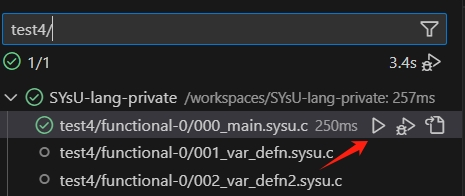
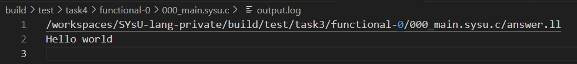
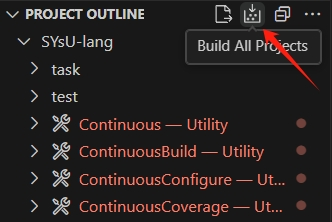

## 前言

恭喜同学们顺利完成前面三个实验，通过词法分析、语法分析和中间代码生成实现了一个功能完备的编译器前中端。但是在保证程序运行结果正确性的基础上，在实际程序运行时我们往往会关注程序运行的性能。对于一个成熟的编译器，中间代码优化是非常重要的一个部分，它负责进行后端平台无关的通用优化，降低我们编写高性能程序的难度，让我们在编程时能够更专注于代码逻辑而非如何提高代码运行性能。

## 任务描述

本次实验的实验内容是实现一个LLVM IR优化器，对中间代码生成的结果进行优化。实验的输入与输出均为LLVM IR，要求同学们在保证代码正确性的基础上面向给定测试样例进行代码优化。在LLVM中，中端优化函数以Pass的形式存在，其作用是对输入的LLVM IR进行分析与变换，并输出变换后的LLVM IR。每个优化由一个或多个Transform Pass实现，不同优化的pass之间相互独立。在本次实验没有标准答案，同学们可以自由发挥，借助任何可能的优化方法提升程序的运行效率，并通过测评系统测评。

## 评分标准

实验的评分主要分为两个部分：正确性与程序运行性能。对于一个编译器而言，保证正确性是必然要求。中间代码优化实验的比较对象为`clang O2`，对于每个实验测例，我们将比较优化后的程序运行的输出与返回值：若两者相同，则进入性能测试；若两者不相同，则实验得分为0。

通过正确性验证后，我们将`clang O2`优化后的程序运行时间与优化器优化后的程序运行时间求比值后开平方，再将性能测例中每个测例的分数取平均值，结果即为性能测例得分。若某测例在优化器优化后运行性能超过`clang O2`，则该测例记为满分。**实验四将综合考虑同学们实现的优化、测评系统中排行榜的排名以及性能测例得分进行赋分，性能测例分数并非实验四最终得分。**

本次实验不允许出现以下行为，若出现以下行为将视为作弊与抄袭：

* 面向测例编程，包括但不限于：通过识别文件名、输入、特定代码段等手段进行代码优化
* 直接调用LLVM内置的**Transform Pass**，或者直接复制LLVM提供的Transform Pass代码

我们允许以下行为：

* 在理解LLVM优化源代码的基础上将其简化移植
* 使用LLVM提供的**Analysis Pass**获取优化所需的信息（Transform Pass和Analysis Pass的区别是前者执行后会修改LLVM IR，而后者仅返回信息不改变IR）
* 鼓励同学们添加实验测例中未涉及到的优化并提供相应测例（可在实验报告中说明，我们将在分析优化效果与优化实现难度后酌情加分）

## 调试方法

### 输出调试

为了方便同学们调试优化效果，同学们可以使用本项目提供的调试功能对单个测例进行输出调试（调试准备工作参考[如何调试代码](../introduction/howtouse.md#如何调试代码)一节）。调试时使用`test4/`过滤，因为`task4/`仅执行我们实现的优化并生成优化后的LLVM IR代码，`test4/`则完成优化和评分两个任务（具体差别可以查看`SYsU-lang2/test/task4/CMakeLists.txt`）：



调试成功后可以在`/workspaces/SYsU-lang2/build/test/task4/Testing/Temporary/LastTest.log`文件中查看输出结果。如果选择使用手动执行时，可以使用以下指令。手动执行需要自行保证优化器`task4`与当前task4的代码一致（即是否在代码修改后重新编译生成）：

```shell
task4_out=/workspaces/SYsU-lang2/build/task/4
test3_out=/workspaces/SYsU-lang2/build/test/3
case=functional-0/000_main.sysu.c
output_dir=/workspaces/SYsU-lang2/build/test/4/functional-0/000_main.sysu.c

# 优化LLVM IR
${task4_out}/task4 ${test3_out}/${case}/answer.ll ${output_dir}/output.ll > ${output_dir}/output.log
```

最终输出结果将重定向到`${output_dir}/output.log`中。



### 测例修改

在进行代码优化时，可能存在修改测例以验证优化是否可行的需求。由于测例的缓存机制，添加新测例进行测评需要将`/workspaces/SYsU-lang2/build`文件夹删除后重新构建项目：



重新构建后，使用命令行编译调试单个测例的方式：

```shell
rtlib_include=/workspaces/SYsU-lang2/test/rtlib/include
rtlib_path=/workspaces/SYsU-lang2/build/test/libtest-rtlib.so
case_path=/path/to/your/code.sysu.c
ll_path=/path/to/code.ll
opt_path=/path/to/code_opt.ll
bin_path=/path/to/code_opt
CC=/opt/SYsU-lang/llvm/install/bin/clang

# 生成LLVM IR
${CC} -cc1 -O0 -S -emit-llvm -isystem ${rtlib_include} ${case_path} -o ${ll_path}

# 优化LLVM IR
${task4_out}/task4 ${ll_path} ${opt_path}

# 将LLVM IR编译为二进制文件
${CC} -O0 ${opt_path} ${rtlib_path} -o ${bin_path}
```
